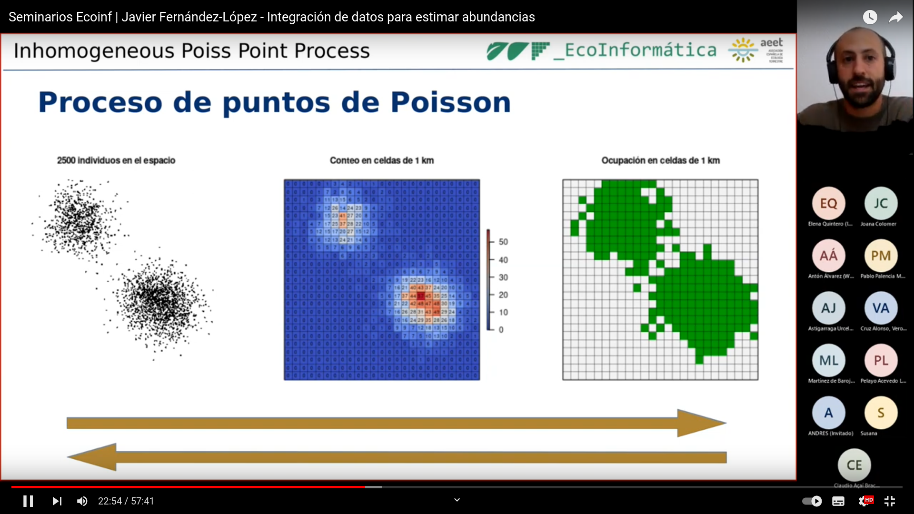
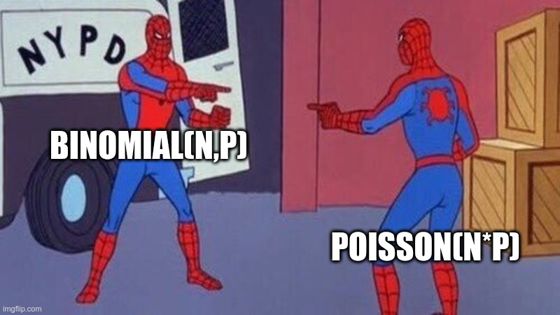

```{=html}
<style type="text/css">
.title {
  display: none;
}

.main-container {
  max-width: 1600px;
  margin-left: auto;
  margin-right: auto;
}

body {
text-align: justify
}

#getting-started img {
  margin-right: 10px;
}

</style>
```

# Outreach

Ecoinformática workshop for AEET (Spanish)

<center>
<a href="https://www.youtube.com/watch?v=ybD4GM_OB3M">
 </a>
</center>

<br/>

Some memes... 

<center>
 </a>
</center>
