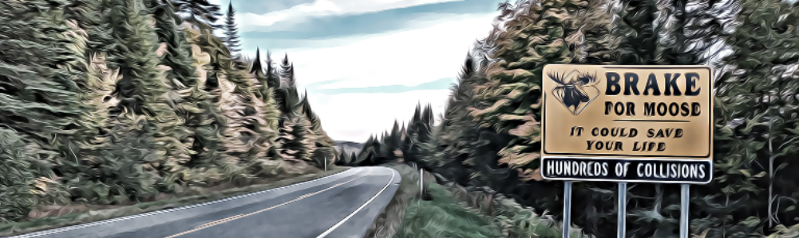

```{=html}
<style type="text/css">
.title {
  display: none;
}

.main-container {
  max-width: 1600px;
  margin-left: auto;
  margin-right: auto;
}

body {
text-align: justify
}

#getting-started img {
  margin-right: 10px;
}

</style>
```

 </a>

# Publications

Here you have some selected publications. Find more in my [Google Schoolar](https://scholar.google.es/citations?hl=es&user=v3biyuIAAAAJ) profile or in my [Researchgate](https://www.researchgate.net/profile/Javier_Fernandez-Lopez).