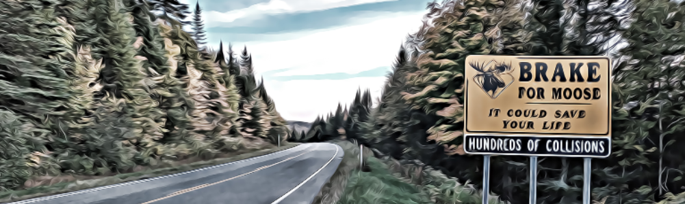

 

Here you have some selected publications. Find more in my [Google Scholar](https://scholar.google.es/citations?hl=es&user=v3biyuIAAAAJ) profile or in my [Researchgate](https://www.researchgate.net/profile/Javier_Fernandez-Lopez).