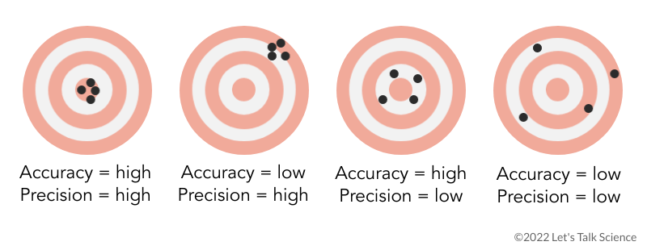

<style>
body {
text-align: justify}
</style>

<br/>
<br/>
<p align="center">
 </a>
</p>
<font size="3">
<br/>

```{r setup, include=FALSE}
knitr::opts_chunk$set(echo = TRUE)
```
```{r klippy, echo=FALSE, include=TRUE, eval=T}
klippy::klippy(tooltip_message = 'Click para copiar', tooltip_success = 'Hecho!',position = c('top', 'right'))
```

 
# **Presentación**

En este espacio se encuentran los contenidos para el Módulo 2 - Test estadísticos en ciencias experimentales del Curso de Estadística ENZOEM, que tiene la siguiente estructura:

  1. Generalidades. [Materiales prácticos](https://jabiologo.github.io/web/tutorials/enzoem_2_files/enzoem2_1.zip) y [presentaciones](https://jabiologo.github.io/web/tutorials/enzoem_2_files/modulo2_1_compressed.pdf)
  2. Principales test paramétricos y no paramétricos. [Materiales prácticos](https://jabiologo.github.io/web/tutorials/enzoem_2_files/enzoem2_2.zip) y [presentaciones](https://jabiologo.github.io/web/tutorials/enzoem_2_files/modulo2_1_2_compressed.pdf).
  3. El modelo lineal general (GLM) y diseños avanzados. [Presentaciones sobre diseños experimentales](https://jabiologo.github.io/web/tutorials/enzoem_2_files/enzoem3.pdf), [materiales prácticos](https://jabiologo.github.io/web/tutorials/enzoem_2_files/enzoem2_3.zip).

# **1. Generalidades**

### Conceptos básicos

La estadística es una ciencia que nos permite cuantificar la realidad y analizarla con el fin de obtener explicaciones o predicciones.

* **Población estadística:** Es el conjunto completo de todos los elementos y sobre los cuales queremos obtener conclusiones (inferencia).

* **Muestra:** Es una parte representativa de la población estadística.

* **Unidad muestral:** Es cada elemento individual de la población o muestra sobre el cual se realiza una observación o medición. Es la entidad básica que se estudia.

* **Variable:** Es una característica o cualidad que puede variar entre los diferentes elementos de una población o muestra. Las variables son lo que medimos, observamos o registramos.

* **Observación (dato):** Es el valor específico que toma una variable para una unidad particular de la población o muestra. Es un registro individual de una medida o característica.


### Exactitud y precisión

<br/>
<p align="center">
 </a>
</p>
<font size="3">
<br/>

### Tipos de variables

1. Cuantitativas
    * Continuas
    * Discretas
2. Semicuantitativas u ordinales
3. Cualitativas o nominales
<br/>

### Distribuciones de probabilidad
<br/><br/>
```{r, echo = FALSE, fig.align = 'center', warning=FALSE}
library(ggplot2)
  ggplot(data.frame(x = c(-7, 5)), aes(x = x)) + 
  stat_function(fun = dnorm, args = list(0, 1),
                aes(colour = "Normal(0,1)"), size = 3, alpha = 0.8) +
    stat_function(fun = dnorm, args = list(-1, 2),
                  aes(colour = "Normal(-1,2)"), size = 3, alpha = 0.8) +
    stat_function(fun = dnorm, args = list(1, 0.5),
                  aes(colour = "Normal(1,0.5)"), size = 3, alpha = 0.8) +
    ylab("frecuencia") +
    #scale_color_brewer(palette="Blues") +
    labs(color=expression(paste('Normal(', mu, ', ', sigma, ')'))) +
  theme_bw() +
    theme(axis.text=element_text(size=20),
          axis.title=element_text(size=20),
          legend.key.size = unit(1, 'cm'),
          legend.text = element_text(size=15),
          legend.title = element_text(size=17))
```
<br/><br/>

```{r, echo = FALSE, fig.align = 'center', warning=FALSE}
# Poisson
  
  df1 <- data.frame(x= factor(c(0:40)), frecuencia = c(dpois(0:40, 3.5)))
  df2 <- data.frame(x= factor(c(0:40)), frecuencia = c(dpois(0:40, 12))) 
  df3 <- data.frame(x= factor(c(0:40)), frecuencia = c(dpois(0:40, 22)))
  
  ggplot(NULL, aes(x, frecuencia)) + 
    geom_bar(aes(fill = "Poisson(3.5)"),stat="identity", data = df1, alpha = 0.5) +
    geom_bar(aes(fill = "Poisson(12)"),stat="identity", data = df2, alpha = 0.5) +
    geom_bar(aes(fill = "Poisson(22)"),stat="identity", data = df3, alpha = 0.5) +
    labs(fill=expression(paste('Poisson(',lambda,')'))) +
    scale_x_discrete(labels=c("0","","","","","5",
                              "","","","","10",
                              "","","","","15",
                              "","","","","20",
                              "","","","","21",
                              "","","","","25",
                              "","","","","30",
                              "","","","","35")) +
    theme_bw() +
    theme(axis.text=element_text(size=20),
          axis.title=element_text(size=20),
          legend.key.size = unit(1, 'cm'),
          legend.text = element_text(size=15),
          legend.title = element_text(size=17))
```

<br/><br/>

```{r, echo = FALSE, fig.align = 'center', warning=FALSE}
  # Binomial
  
  df1 <- data.frame(x= factor(c(0:30)), frecuencia = c(dbinom(0:30,30, 0.15)), name = "df1")
  df2 <- data.frame(x= factor(c(0:30)), frecuencia = c(dbinom(0:30,30, 0.5)), name = "df2") 
  df3 <- data.frame(x= factor(c(0:30)), frecuencia = c(dbinom(0:30,30, 0.7)), name = "df3") 
  
  ggplot(NULL, aes(x, frecuencia)) + 
    geom_bar(aes(fill = "Binomial(30,0.15)"),stat="identity", data = df1, alpha = 0.5) +
    geom_bar(aes(fill = "Binomial(30,0.5)"),stat="identity", data = df2, alpha = 0.5) +
    geom_bar(aes(fill = "Binomial(30,0.7)"),stat="identity", data = df3, alpha = 0.5) +
    labs(fill=expression(paste('Binomial(n, p)'))) +
    scale_x_discrete(labels=c("0","","","","","5",
                              "","","","","10",
                              "","","","","15",
                              "","","","","20",
                              "","","","","21",
                              "","","","","25",
                              "","","","","30")) +
    theme_bw() +
    theme(axis.text=element_text(size=20),
          axis.title=element_text(size=20),
          legend.key.size = unit(1, 'cm'),
          legend.text = element_text(size=15),
          legend.title = element_text(size=17))
```

<br/><br/>

### Estadística descriptiva

* **Media** ($\mu$): promedio de un conjunto de datos.
* **Mediana**: valor central de un conjunto de datos cuando estos están ordenados de menor a mayor. Cuantiles: cuartiles, deciles.
* **Moda**: valor más frecuente dentro de la muestra.
* **Desviación estándar, varianza** ($\sigma$, $\sigma^2$): mide la dispersión o variabilidad de los datos alrededor de la media.

### Contraste de hipótesis

El contraste de hipótesis es un procedimiento estadístico que se utiliza para tomar decisiones sobre una **afirmación o suposición (hipótesis)** acerca de una **población**, basándose en la evidencia de una **muestra** de datos.

* **Hipótesis nula ($H_0$):** Afirmación inicial que asumimos como verdadera. No hay efecto, no hay diferencia o no hay relación entre las variables en la población.

* **Hipótesis alternativa ($H_1$):** Sugiere que sí hay un efecto, una diferencia o una relación entre las variables de la población.

* **P-valor:** una medida de la fuerza de la evidencia en contra de la hipótesis nula. Un P-valor pequeño (generalmente menor a 0.05) indica que el resultado observado es poco probable bajo la hipótesis nula, lo que nos lleva a rechazarla

### Errores y valores anómalos

* **Errores:** fallos no intencionados durante el proceso de recolección, medición o registro de los datos. Pueden deberse a equivocaciones humanas, mal funcionamiento de instrumentos, o fallos en la transcripción.

* **Valores anómalos:** observaciones individuales en un conjunto de datos que se desvían significativamente de la mayoría de los demás valores. Pueden ser el resultado de errores en los datos o representar fenómenos inusuales pero genuinos.

### Transformaciones: estandarización y logaritmo

* **Estandarización:** transformar nuestra variable para que su media sea cero y su desviación estándar sea uno.

$\frac{(x_i - \bar{x})}{\sigma}$

* **Logaritmo:** comprimir valores grandes, estirar valores pequeños
1) Linealizar relaciones no lineales.
2) Estabilizar la varianza (homocedasticidad).
3) Reducir la asimetría (lo que a menudo lleva a una distribución normal).
4) Reflejar la naturaleza multiplicativa o proporcional de muchos fenómenos del mundo real.

# **2. Principales test paramétricos y no paramétricos**

# **3. El modelo lineal general (GLM)**

# **4. Diseños avanzados: GLS y GLMM**

