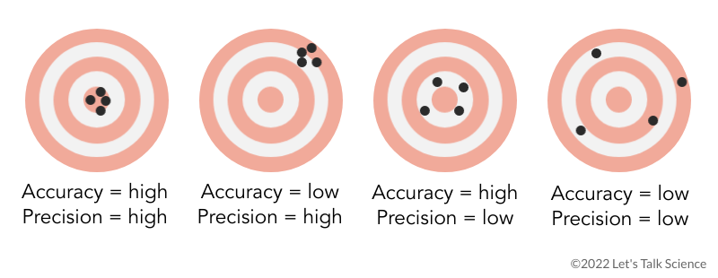

<style>
body {
text-align: justify}
</style>

<br/>
<br/>
<p align="center">
 </a>
</p>
<font size="3">
<br/>

```{r setup, include=FALSE}
knitr::opts_chunk$set(echo = TRUE)
```
```{r klippy, echo=FALSE, include=TRUE, eval=T}
klippy::klippy(tooltip_message = 'Click para copiar', tooltip_success = 'Hecho!',position = c('top', 'right'))
```

 
# **Presentación**

En este espacio se encuentran los contenidos para el Módulo 3 - Modelos avanzados en estudios observacionales, del Curso de Estadística ENZOEM, que tiene la siguiente estructura:

  1. Modelos mixtos: efectos fijos y efectos aleatorios. [Materiales prácticos]() y [presentaciones]()
  2. Modelos espacio-temporales. [Materiales prácticos]() y [presentaciones]().
  3. Relaciones no lineales. [Materiales prácticos]() y [presentaciones]().
  4. Técnicas multivariante. [Materiales prácticos]() y [presentaciones]().

# **1. Modelos mixtos: efectos fijos y efectos aleatorios**

### Modelo Lineal General


### Covariables: efectos fijos

<br/>
<p align="center">
 </a>
</p>
<font size="3">
<br/>

### Efectos aleatorios

1. Cuantitativas
    * Continuas
    * Discretas
2. Semicuantitativas u ordinales
3. Cualitativas o nominales
<br/>

### Utilidad y ejemplos

<br/><br/>
```{r, echo = FALSE, fig.align = 'center', warning=FALSE}

```
<br/><br/>


# **2. Modelos espacio-temporales**

### Estudios longitudinales

# **3. Relaciones no lineales**

# **4. Técnicas multivariante**

