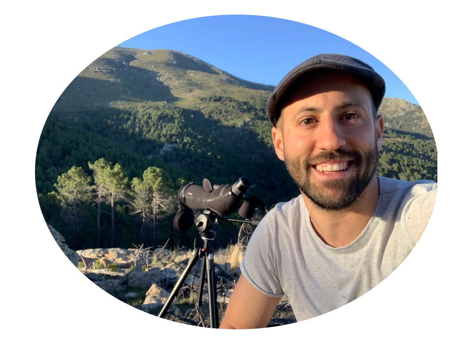

```{=html}
<style type="text/css">
.title {
  display: none;
}

.main-container {
  max-width: 1600px;
  margin-left: auto;
  margin-right: auto;
}

body {
text-align: justify
}

#getting-started img {
  margin-right: 10px;
}

</style>
```

<div class="row" style="padding-top: 30px;">
<div class="col-sm-6">


# **About me...**

I'm broadly interested in statistical/spatial ecology and wildlife conservation. I'm currently working on mammal abundance and distribution modeling focusing on game species. I combine different data sources such as camera-trap data, distance sampling or hunting statistics by using integrated distribution models in a hierarchical framework. I use Bayesian inference and cartography tools to help for evidence-based decision making in wildlife management and in the design of monitoring programs.

Graduated in Biology Sciences and Ms in Conservation Biology (Universidad Complutense de Madrid, Madrid, Spain). I developed my PhD about phylogeny, biogeography and distribution of the corticioid fungus genus Xylodon (Real Jardín Botánico, CSIC, Madrid, Spain). I worked during two years as researcher assistant at the Institute for Game and Wildlife Research IREC (UCLM – CSIC, Ciudad Real, Spain) for the [ENETWILD](https://enetwild.com/) project about mammal distribution at European scale. I performed one year postdoc at University of Massachusetts (Boston, USA) with [Liam Revell](https://faculty.umb.edu/liam.revell/people/index.html) and two year postdoc at Centre d’Ecologie Foncionnelle et Evolutive (Montpellier, France) with [Olivier Gimenez](https://www3.cefe.cnrs.fr/en/research/biodiversity-and-conservation/biostatistics-and-population-biology/846-french/recherche/bc/bbp/pdoc/4150-javier-fernandez-lopez). I’m currently a postdoctoral researcher at the Institute for Game and Wildlife Research IREC (UCLM – CSIC, Ciudad Real, Spain).

Contact me!

[](https://twitter.com/javi_ferlop)

<span align="left">
  <a href="mailto:jflopez.bio@gmail.com">
    
  </a>
</span>
</div>


<div class="col-sm-6">
 
</div>

<center>
 </a>
</center>

