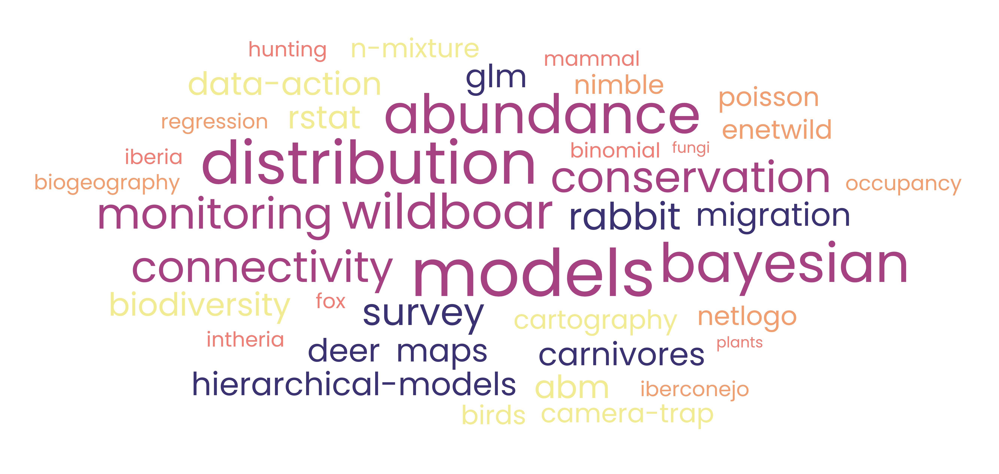

```{=html}
<style type="text/css">
.title {
  display: none;
}

body {
text-align: justify
}

#getting-started img {
  margin-right: 10px;
}

</style>
```

<div class="row" style="padding-top: 30px;">
<div class="col-sm-6">

# **About me...**

Interested in statistical ecology and wildlife and natural resource conservation. Currently working on mammal abundance and distribution modeling, focusing on human-animal interactions and monitoring design. Also Bayesian modeling.


## Links

1. my github profile [https://github.com/jabiologo](https://github.com/jabiologo)

2. my [blog](https://allthiswasfield.blogspot.com/)

3. the rWind R package [CRAN link](https://cran.r-project.org/web/packages/rWind/index.html).

4. more research in my [Google Schoolar](https://scholar.google.es/citations?hl=es&user=v3biyuIAAAAJ)

</div>
<div class="col-sm-6">


<a href = "http://allthiswasfield.blogspot.com/">

</a>
</div>
