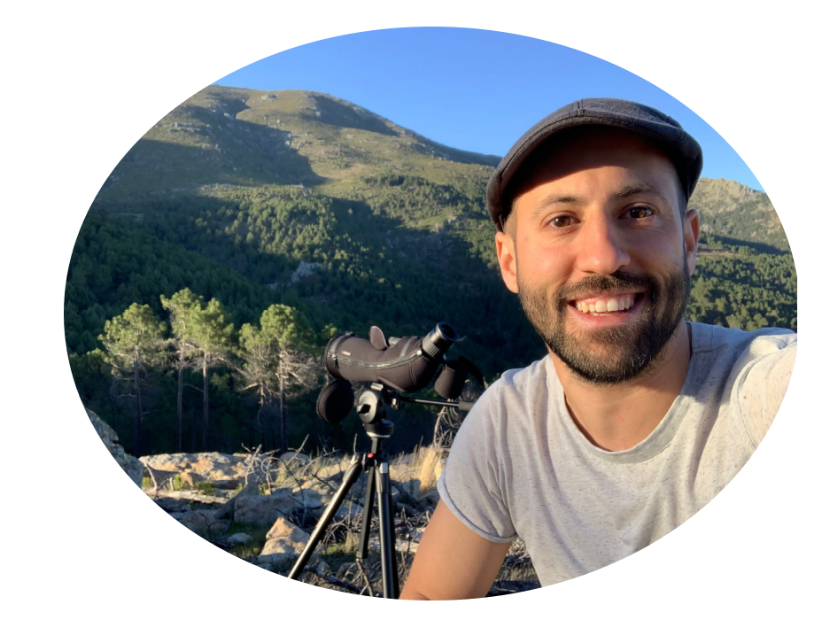

```{=html}
<section class="profile-hero" aria-labelledby="hero-title">
<div class="hero-copy">
<p class="eyebrow">Ecology · Statistics · Conservation</p>
<h1 id="hero-title">Wildlife patterns.<br><em>The processes behind them.</em></h1>
<p class="hero-summary">I'm Javier Fernández-López. I study wildlife patterns to understand the ecological processes that shape them. Biomathematics, Complutense University of Madrid.</p>
<div class="hero-actions"><a class="button-primary" href="Research.html">Explore my research <span aria-hidden="true">↗</span></a><a class="button-secondary" href="Tutorials.html">Teaching & resources <span aria-hidden="true">→</span></a></div>
<div class="profile-links" aria-label="Academic profiles"><a class="button-secondary" href="https://orcid.org/0000-0003-4352-0252"><span class="profile-icon" aria-hidden="true">iD</span> ORCID ↗</a><a class="button-secondary" href="https://scholar.google.com/citations?user=v3biyuIAAAAJ"><span aria-hidden="true">↗</span> Google Scholar</a></div>
</div>
<div class="hero-portrait"><p>Javier Fernández-López<span>Biomathematics · Complutense University of Madrid</span></p></div>
</section>
<div class="research-topics" aria-label="Research interests"><span>Bayesian inference</span><span>Wildlife monitoring</span><span>Spatial ecology</span><span>Open science</span></div>
```

## About my research

I'm broadly interested in statistical/spatial ecology and wildlife conservation. I'm currently working on mammal abundance and distribution modeling focusing on game species. I combine different data sources such as camera-trap data, distance sampling or hunting statistics by using integrated distribution models in a hierarchical framework. I use Bayesian inference and cartography tools to help for evidence-based decision making in wildlife management and in the design of monitoring programs.


## About me

Graduated in Biology Sciences and Ms in Conservation Biology (Universidad Complutense de Madrid, Madrid, Spain). I developed my PhD about phylogeny, biogeography and distribution of the corticioid fungus genus Xylodon (Real Jardín Botánico, CSIC, Madrid, Spain). I worked during two years as researcher assistant at the Institute for Game and Wildlife Research IREC (UCLM – CSIC, Ciudad Real, Spain) for the [ENETWILD](https://enetwild.com/) project about mammal distribution at European scale. I performed one year postdoc at University of Massachusetts (Boston, USA) with [Liam Revell](https://faculty.umb.edu/liam.revell/people/index.html) and two year postdoc at Centre d’Ecologie Foncionnelle et Evolutive (Montpellier, France) with [Olivier Gimenez](https://www3.cefe.cnrs.fr/en/research/biodiversity-and-conservation/biostatistics-and-population-biology/846-french/recherche/bc/bbp/pdoc/4150-javier-fernandez-lopez). In 2024, I returned to IREC to develop the INTHERIA project.

Since September 2025, I have been an Assistant Professor (Profesor Ayudante Doctor) in the **Biomathematics Unit, Department of Biodiversity, Ecology and Evolution, Faculty of Biological Sciences, Complutense University of Madrid**. My teaching and research bring together mathematics, ecology and biodiversity conservation. [UCM profile](https://produccioncientifica.ucm.es/investigadores/1196011/detalle).


```{=html}
<div class="contact-panel"><div><p class="eyebrow">Get in touch</p><h2>Let's connect.</h2></div><a href="mailto:javfer05@ucm.es">javfer05@ucm.es <span aria-hidden="true">↗</span></a><a href="https://twitter.com/javi_ferlop">Twitter / X <span aria-hidden="true">↗</span></a></div>
```
