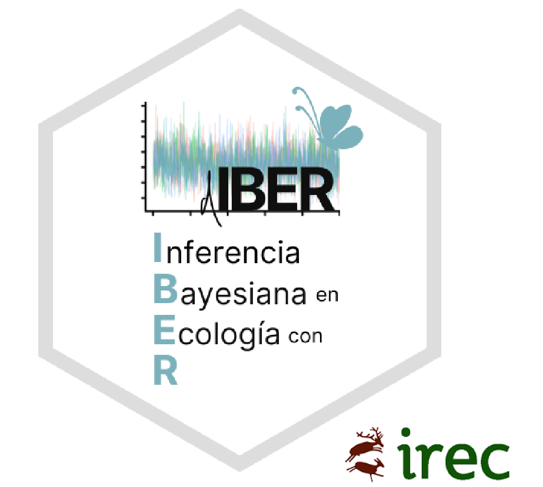

<style>
body {
text-align: justify}
</style>

<br/>
<br/>
<p align="center">
 </a>
</p>
<font size="3">
<br/>

 
# **Presentación**

 En este espacio se encuentran los contenidospara el taller **Inferencia Bayesiana en Ecología con R (IBER)** que se impartirá en el Instituto de Investigación en Recursos Cinegéticos del 13 al 15 de mayo de 2024. En los siguientes enlaces se pueden descargar los materiales se utilizarán durante el taller:
 
* Presentaciones de los contenidos teóricos (ver **Programa** más abajo).
* Scripts y datos necesarios para las sesiones prácticas (ver **Programa** más abajo).
* [_Cheatsheet_](https://jabiologo.github.io/web/tutorials/prob_dist_links_merged.pdf) sobre distribuciones de probabilidad (_by_ [Sonia Illanas (IREC)](https://scholar.google.com/citations?hl=es&user=ew25H7QAAAAJ&view_op=list_works&sortby=pubdate) & [Javier Fernández-López (IREC)](https://scholar.google.com/citations?hl=es&user=v3biyuIAAAAJ&view_op=list_works&sortby=pubdate))

Gran parte de este curso, incluidos algunos materiales, diseño de la web y el conocimiento de los ponentes se debe a [Olivier Gimenez](https://oliviergimenez.github.io/).

# **Información general**

**Qué:** Este es un taller introductorio a la Inferencia Bayesiana. Se explicarán los conceptos básicos de probabilidad y modelos lineales generalizados para posteriormente poder ajustar este tipo de modelos mediante Inferencia Bayesiana en [R y NIMBLE](https://r-nimble.org/). Finalmente se darán unas pinceladas sobre cómo ajustar modelos algo más complejos para el estudio de la abundancia y la distribución de las especies: modelos de ocupación, _N-mixture_ y _spatial capture-recapture_.

**Para quién:** Este es un taller pensado para ecólogos. No se requiere experiencia previa en Inferencia Bayesiana o NIMBLE. Algo de experiencia en R es necesaria.

**Quién:** Impartido por [Valentin Lauret (IREC)](https://scholar.google.com/citations?hl=es&user=hbi_zlMAAAAJ) y [Javier Fernandez-Lopez (IREC)](https://scholar.google.com/citations?user=v3biyuIAAAAJ&hl=es&authuser=1)

**Cuándo** 13-15 de Mayo, 2024. De 9h30 a 13h30.

**Dónde:** Salón de Actos del Instituto de Investigaciones en Recursos Cinegéticos, IREC, Royal City ;)

# **Programa**

### Día 1 - Introducción al modelado con R y NIMBLE

  1. **Modelos lineales generalizados con R**: distribuciones de probabilidad, programación, simulaciones y modelos básicos. [Presentaciones](https://jabiologo.quarto.pub/bloque_1_1_teoria/#/) y [Script](https://raw.githubusercontent.com/jabiologo/web/master/script_bloque_1_1.R)
  2. **Introducción al análisis Bayesiano en NIMBLE**: Qué es Bayesiano, qué es NIMBLE, aplicaciones en ecología. [Presentaciones](https://vlauret.quarto.pub/diberticurso_2_introbayesian/#/title-slide) y [Script](https://raw.githubusercontent.com/valentinlauret/diberticurso/main/codes/2_introBayesian.R)
  
### Día 2 - Modelos ecológicos más avanzados

  1. Modelos de Ocupación
  2. Modelos _N-mixture_
  3. _Spatial Capture-Recpature_
  
### Día 3 - Aplicaciones

  1. Un caso de estudio, impartido por [Pepe Jiménez](https://scholar.google.com/citations?user=ACYEKqAAAAAJ&hl=es).
  2. Trabajo personal con datos propios (o provistos por los ponentes).

#  **Requerimientos**

  * Es necesario instalar [R](https://cloud.r-project.org/) (y  [RStudio](https://posit.co/download/rstudio-desktop/#download) para mayor comodidad).

  * Es necesario instalar `Nimble` siguiendo [estos consejos](https://r-nimble.org/download). Nótese que para usuarios de Windows quizás sea necesario instalar [RTools](https://cran.r-project.org/bin/windows/Rtools/) si no se ha instalado previamente. Cuando esté todo instalado, ejecuta el siguiente código en R. Si funciona sin errores, todo está correcto. Sino, ponte en contacto con nosotros!
  
```
library(nimble)
  code <- nimbleCode({
  y ~ dnorm(0,1)
  })
  model <- nimbleModel(code)
  cModel <- compileNimble(model)
```

  * Instalar los siguientes paquetes de R: `tidyverse`, `mcmcplots`, `coda`. Puedes instalarlos todos ejecutando el siguiente código en R:

```
install.packages(c("tidyverse", "mcmcplots", "coda"))
```