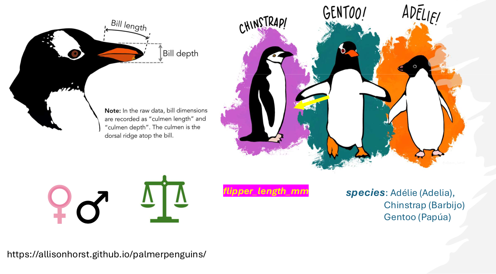

<style>
body {
text-align: justify}
</style>

<br/>
<br/>
<p align="center">
 </a>
</p>
<font size="3">
<br/>

```{r setup, include=FALSE}
knitr::opts_chunk$set(echo = TRUE)
```
```{r klippy, echo=FALSE, include=TRUE, eval=T}
klippy::klippy(tooltip_message = 'Click para copiar', tooltip_success = 'Hecho!',position = c('top', 'right'))
```

 
# **Presentación**

En este espacio se encuentran los contenidos para el Módulo 2 - Test estadísticos en ciencias experimentales del Curso de Estadística ENZOEM, que tiene la siguiente estructura:

  1. Generalidades. [Materiales]()
  2. Principales test paramétricos y no paramétricos. [Materiales]()
  3. El modelo lineal generalizado. [Materiales]()
  4. Diseños avanzados: GLS y GLMM. [Materiales]()

# **1. El lenguaje R y el entorno R-Studio: funciones y objetos**

#### **¿Por qué R?** 
R es un entorno y lenguaje de programación con enfoque al análisis estadístico. Este tipo de herramientas pueden tener desventajas (estár más pendiente de aprender a utilizar la herramienta que a enterarse de la teoría, una curva de aprendizaje muy pronunciada, etc.). Sin embargo, también hay buenas razones para trabajar con esta herramienta:

* R es una herramienta libre y gratuita para todos los sistemas operativos.
* R no es solamente un software para análisis estadístico.
* Es muy probable que tarde o temprano nos veamos "obligad@s" utilizar esta herramienta.
<br/><br/>

#### **Descarga e instalación de R y RStudio** 

En este curso utilizaremos dos softwares que deberemos descargar e instalar:

* **R** lo podemos descargar en [https://cran.r-project.org/](https://cran.r-project.org/) para los sistemas operativos Windows, macOS y Linux.
* **RStudio** lo podemos descargar en [https://posit.co/download/rstudio-desktop/](https://posit.co/download/rstudio-desktop/), también para cualquer sistema operativo

Una vez descargados, RStudio se vinculará con R automáticamente.
<br/><br/>


```{r ch1, message=T, cache = T, eval = F}
# Guardamos el archivo en un obejto que denominaremos "datos"
datos <- read.csv("https://raw.githubusercontent.com/jabiologo/web/master/tutorials/estadisticaBasica_files/datosPracticas.csv")

class(datos)

# Podemos utilizar la función head() para explorar los primeros elementos de datos
head(datos)

# Podemos utilizar la función str() para ver la estructura interna del data.frame
str(datos)

# O incluso podemos pedirle un resumen con summary()
summary(datos)

```
<br/>

Tenemos varias formas de manejar los datos contenidos en un `data.frame`. Por ejemplo, si queremos explorar alguna columna podemos utilizar el símbolo del dólar `$` para seleccionarla por su nombre. Por ejemplo `datos$peso`. Si lo que queremos es seleccionar un dato en concreto, podemos utilizar los corchetes `[]` para acceder a los elementos del `data.frame` indicando su posición en cuanto a filas y columnas separados por una coma con la forma `datos[fila,columna]`. Por ejemplo, si queremos seleccionar el dato que está en la fila 3 y columna 4, podemos emplear `datos[3,4]`. Si dejamos uno de los dos huecos en blanco, obtendremos toda la fila o toda la columna. Por ejemplo, si quremos todos los datos de la fila 7, podemos hacer `datos[7, ]`. Veamos estos ejemplos.

La gramática de los gráficos se basa en la idea de que cualquier gráfico se puede construir a partir de los siguientes componentes:

-   **Datos (Data)**: El conjunto de datos que se va a visualizar.

-   **Mapeo**: El mapeo define cómo se asignan las partes de los datos a los atributos estéticos de los objetos geométricos. Esto se hace usando la función `aes()`

-   **Capas (Layers)**: Las capas son el corazón de cualquier gráfico. Cada capa consiste en:

    -   **Geometría (Geometries)**: Determina cómo se muestran los datos (puntos, líneas, rectángulos, etc.).

    -   **Transformación estadística (Statistics)**: Puede calcular nuevas variables a partir de los datos.

    -   **Ajuste de posición**: Determina dónde se muestra cada pieza de datos. Las capas se construyen usando funciones `geom_*()` y `stat_*()`.

-   **Facetas (Facets)**: Permiten dividir los datos en múltiples paneles basados en una o más variables. Esto se hace usando funciones como `facet_wrap()` y `facet_grid()`.

-   **Coordenadas (Coordinates)**: Definen el sistema de coordenadas del gráfico. Por ejemplo, `coord_flip()` invierte los ejes x e y.

-   **Temas Visuales (Themes)**: Personalización de la apariencia del gráfico. theme( )

A partir de estos componentes es posible generar una gran variedad de tipos y formatos de gráficos de una forma flexible.

[CheatSheet (chuleta código)](https://github.com/rstudio/cheatsheets/blob/main/data-visualization.pdf)

### **Como crear un gráfico básico**

Empecemos creando un gráfico de dispersión básico a partir de los dato***s [palmerpenguins](https://allisonhorst.github.io/palmerpenguins/)***. Los datos fueron recogidos y puestos a disposición por la Dra. Kristen Gorman y la Estación LTER Palmer, en la Antártida.

<br/>
<p align="center">
 </a>
</p>
<font size="3">
<br/><br/>

Artwork by \@allison_horst


