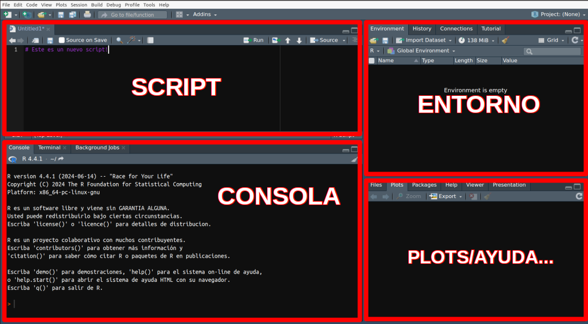

<style>
body {
text-align: justify}
</style>

<br/>
<br/>
<p align="center">
 </a>
</p>
<font size="3">
<br/>

```{r setup, include=FALSE}
knitr::opts_chunk$set(echo = TRUE)
```
```{r klippy, echo=FALSE, include=TRUE}
klippy::klippy(tooltip_message = 'Click para copiar', tooltip_success = 'Hecho!',position = c('top', 'right'))
```

 
# **Presentación**

En este espacio se encuentran los contenidos para las prácticas del tema **Estadística básica en ciencias experimentales** de la asignatura Bases de la investigación en ciencias experimentales (Máster Universitario en Investigación Básica y Aplicada en Recursos Cinegéticos - MUIBARC). En los siguientes enlaces se pueden descargar los materiales se utilizarán durante el taller:
 
* Una **introducción al entorno R**, la herramienta que utilizaremos en las prácticas
* Presentaciones de los contenidos prácticos (ver **Prácticas** más abajo).
* Scripts y datos necesarios para las sesiones prácticas (ver **Prácticas** más abajo).
* Datos necesarios los ejercicios (ver **Ejercicios** más abajo).

Este tema se ha realizado en base a los contenidos previamente desarrollados por Lorenzo Pérez Rodríguez y extendidos por Jéssica Jiménez-Peñuela, Daniel Parejo-Pulido y Javier Fernández-López.

# **Introducción al entorno R**

#### **¿Por qué R?** 
R es un entorno y lenguaje de programación con un enfoque al análisis estadístico. Al preparar estas prácticas tuvimos serias dudas sobre si adoptar **R** como _herramienta_ para aplicar los _contenidos_ vistos en la teoría, u optar por un software con el clásico diseño "por ventanas". Entendemos que adoptar herramientas _complicadas_ para trabajar contenidos que ya de por sí son complicados puede tener sus desventajas (estár más pendiente de aprender a utilizar la herramienta que a enterarse de la teoría, por ejemplo). También sabemos que R tiene una **curva de aprendizaje empinada**, sobre todo al principio. Sin embargo, hay varias razones para empezar a trabajar con esta herramienta:

* R es una herramienta libre y gratuita para todos los sistemas operativos.
* R no es solo un software para análisis estadístico.
* Es muy probable que tarde o temprano tengáis que utilizarla.
<br/><br/>

#### **Descarga e instalación de R y RStudio** 

Como ya hemos comentado, en esta práctica utilizaremos dos softwares que deberemos descargar e instalar en el caso de ser necesario:

* **R** lo podemos descargar en [https://cran.r-project.org/](https://cran.r-project.org/) para los sistemas operativos Windows, macOS y Linux.
* **RStudio** lo podemos descargar en [https://posit.co/download/rstudio-desktop/](https://posit.co/download/rstudio-desktop/), también para cualquer sistema operativo

Una vez descargados, RStudio se vinculará con R automáticamente.
<br/><br/>

#### **Un paseo por R y RStudio** 

Es importante diferenciar entre R y RStudio. El software o lenguaje que utilizamos para los análisis estadisticos es **R**, por tanto podemos utilizar la consola de R por sí sola. **RStudio es un IDE** (del inglés _integrated development environment_), un entorno de desarrollo integrado, una "carcasa" que envuelve a R y facilita su uso. 
Es imporante familiarizarse con RStudio, ya que utilizaremos R a través de él. Tómate unos minutos para explorar sus diferentes paneles y personalizar su diseño:

* Diferencia entre _consola_ y _script_
* Visualiza tu _entorno de trabajo_, tu ventana de _gráficos (plots)_, tus _librerías (paquetes)_ cargadas, etc. 
* También puedes cambiar el color de fondo, aumentar el tamaño de letra, etc.


<br/>
<p align="center">
 </a>
</p>
<font size="3">
<br/><br/>

#### **Las `funciones()`**

Las **`funciones()`** son la "maquinaria" de R, las que realizan el trabajo. Se pueden identificar porque generalmente van seguidas de unos paréntesis entre los cuales se colocan sus **argumentos**. Los argumentos de una función son elementos que necesita esa función para ejecutarse y suelen ir separados por _comas_ $,$. Por ejemplo, existe una función que se llama "concatenar" (que en el lenguaje R se escribe `c()`), que simplemente sirve para unir en el mismo vector una serie de elementos (letras, números, etc.). Vamos a utilizar esa función para unir en un único vector una serie de números.

```{r ch1, message=F, cache = T, eval = T}
# La almohadilla se utiliza para incluir un comentario. Todo lo que se encuentre
# después de una almohadilla no se ejecutará en la consola.

# Unir los números 3, 7, 12 y 4 en un único vector
c(3, 7, 12, 4)

```

* ¿Cuál es la función? ¿Cuáles son sus argumentos?

Imaginemos que ahora queremos hallar la media de esos números. Podemos utilizar otra función denominada `mean()` a la cual le introduciremos los numeros que hemos concatenado anteriormente como único argumento:

```{r ch2, message=F, cache = T, eval = T}
# Obtener la media de los números 3, 7, 12 y 4
mean(c(3, 7, 12, 4))
```

Todas las funciones de R se alamcenan en "bibliotecas" o librerías (habitualmente denominados paquetes). Estos paquetes podemos entenderlos como cajas de herramientas donde se almacenan las herramientas que queremos utilizar. Hay algunos paquetes que vienen instalados y cargados por defecto en R. Sin embargo, otros los tenemos que descargar e instalar por primera vez y luego cargarlos en nuestra sesión cada vez que queramos utilizarlos. Por ejemplo, el paquete `lme4` se utiliza frecuentemente para ajustar modelos generales lineales mixtos. Podemos descargarlo, instalarlo y cargarlo en nuestra sesión de R de la siguiente manera:

```{r ch3, message=F, cache = T, eval = F}
# Descargamos e instalamos el paquete
install.packages("lme4")
# Cargamos el paquete en nuestra sesión
library(lme4)
```

Una de las grandes ventajas (o inconvenientes?) de R es que es un software libre, por lo que cualquiera puede desarrollar sus propios paquetes con las herramientas (funciones) que necesite y ponerlo a disposición de la comunidad de usuarios. Si tenéis curiosidad, [aquí](https://www.youtube.com/watch?v=ctsGXwaxA1o&list=PL4ZUlAlk7Qic9a6aBIMcRs7_CLbIzCalW) podéis encontrar un pequeño tutorial sobre como hacerlo.

<br/><br/>
#### **Los objetos**

Los **objetos** en R son los contenedores donde almacenamos los resultados (outputs) de las funciones. Podemos identificarlos porque suelen aparecer por primera vez precediendo a los caracteres `<-`, que simbolizan una flecha que señala hacia la izquierda. Cada vez que se quiera crear un objeto se le ha de dar un nombre, el que queramos, aunque suele ser conveniente darle un nombre que tenga sentido. Por ejemplo, vamos a almacenar en un objeto que vamos a llamar "numeros" la concatenación de valores que creamos anteriormente:

```{r ch4, message=F, cache = T, eval = T}
# Almacenamos en un objeto llamado "numeros" el resultado de concatenar 3, 7, 12 y 4
numeros <- c(3, 7, 12, 4)

# Ahora podemos "llamar" a "numeros" para ver qué tiene dentro
numeros

# También podemos utilizar a "numeros" dentro de otra función, por ejemplo mean()
mean(numeros)

# Por último podemos guardar dentro de otro objeto el resultado de la linea anterior

m <- mean(numeros)
m
```

 Todos los objetos en R tienen una clase, que informa sobre el tipo de objeto que es. Por ejemplo, si es un vector de números será `numeric`, pero si lo que almacena son caracteres su clase será `character`. Hay muschísimas clases de objetos (¡incluso se pueden crear clases nuevas!). Conocer la clase de nuestros objetos es muy important, puesto que **algunas funciones necesitan que sus argumentos sean de una clase específica**, y sino no funcionarán. Por ejemplo, no podemos hacer la media de las letras "a", "b" y "c", pero sí podremos hacer la media de los números 1, 2 y 3.

```{r ch5, message=T, cache = T, eval = T}
# Para averiguar la clase de un objeto usamos la función class()
class(numeros)

# Vamos a crear un objeto con los caracteres "a", "b" y "c"
letras <- c("a", "b", "c")

# Exploramos la clase de letras
class(letras)

# Vamos a intentar hacer la media de letras
mean(letras)

```

<br/><br/>

#### **Directorio y entorno de trabajo**


<br/><br/>

#### **La ayuda! `help()` y preguntar a Google**

<br/><br/>

# **Prácticas**

R es un entorno y lenguaje de programación con un enfoque al análisis estadístico.

# **Ejercicios**

R es un entorno y lenguaje de programación con un enfoque al análisis estadístico.
