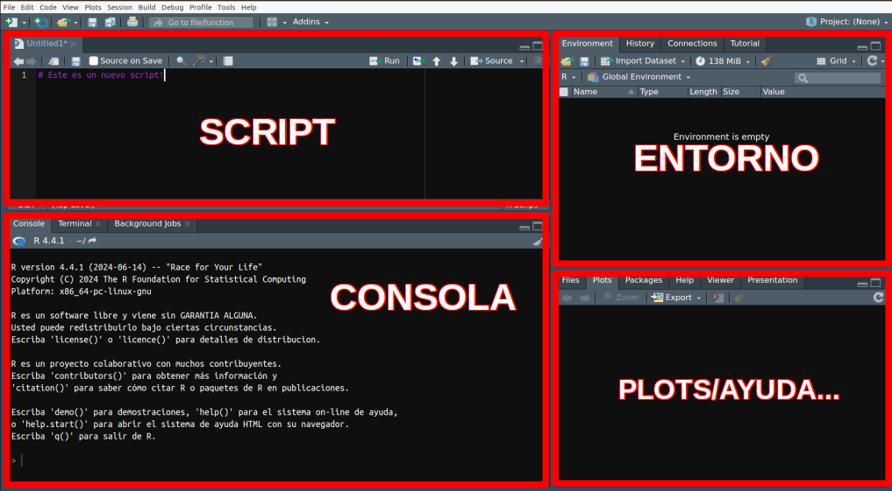
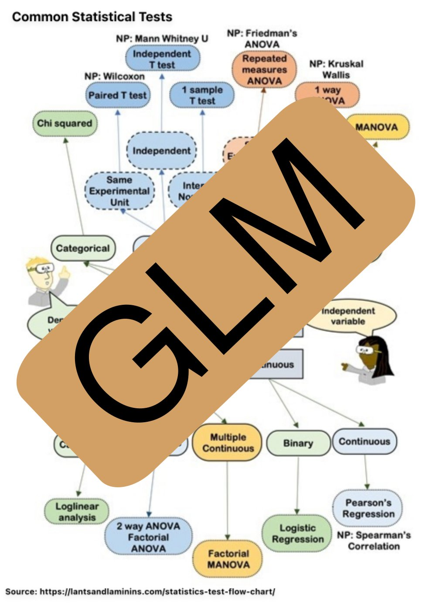

<style>
body {
text-align: justify}
</style>

<br/>
<br/>
<p align="center">
 </a>
</p>
<font size="3">
<br/>

```{r setup, include=FALSE}
knitr::opts_chunk$set(echo = TRUE)
```

Para una mejor visualización de este documento se puede visitar [https://jabiologo.github.io/web/tutorials/estadisticaBasica.html](https://jabiologo.github.io/web/tutorials/estadisticaBasica.html)
 
# **Presentación**

En este espacio se encuentran los contenidos para las prácticas del tema **Estadística básica en ciencias experimentales** de la asignatura Bases de la investigación en ciencias experimentales, coordinada por Joaquín Vicente (Máster Universitario en Investigación Básica y Aplicada en Recursos Cinegéticos - MUIBARC). En los siguientes enlaces se pueden descargar los materiales se utilizarán durante el taller:
 
* Una **introducción al entorno R**, la herramienta que utilizaremos en las prácticas
* Una [presentación](https://jabiologo.github.io/web/tutorials/estadisticaBasica_files/bases.pdf) de los contenidos prácticos.
* [Scripts]() y [datos] necesarios para las sesiones prácticas (ver **Prácticas** más abajo).
* [Datos]() necesarios los ejercicios (ver **Ejercicios** más abajo).

Este tema se ha realizado en base a los contenidos previamente desarrollados por Lorenzo Pérez Rodríguez y extendidos por Jéssica Jiménez-Peñuela, Daniel Parejo-Pulido y Javier Fernández-López.

# **Introducción al entorno R**

#### **¿Por qué R?** 
R es un entorno y lenguaje de programación con un enfoque al análisis estadístico. Al preparar estas prácticas tuvimos serias dudas sobre si adoptar **R** como _herramienta_ para aplicar los _contenidos_ vistos en la teoría, u optar por un software con el clásico diseño "por ventanas". Entendemos que adoptar herramientas _complicadas_ para trabajar contenidos que ya de por sí son complicados puede tener sus desventajas (estár más pendiente de aprender a utilizar la herramienta que a enterarse de la teoría, por ejemplo). También sabemos que R tiene una **curva de aprendizaje empinada**, sobre todo al principio. Sin embargo, hay varias razones para empezar a trabajar con esta herramienta:

* R es una herramienta libre y gratuita para todos los sistemas operativos.
* R no es solamente un software para análisis estadístico.
* Es muy probable que tarde o temprano tengáis que utilizar esta herramienta.
<br/><br/>

#### **Descarga e instalación de R y RStudio** 

Como ya hemos comentado, en esta práctica utilizaremos dos softwares que deberemos descargar e instalar en el caso de ser necesario:

* **R** lo podemos descargar en [https://cran.r-project.org/](https://cran.r-project.org/) para los sistemas operativos Windows, macOS y Linux.
* **RStudio** lo podemos descargar en [https://posit.co/download/rstudio-desktop/](https://posit.co/download/rstudio-desktop/), también para cualquer sistema operativo

Una vez descargados, RStudio se vinculará con R automáticamente.
<br/><br/>

#### **Un paseo por R y RStudio** 

Es importante diferenciar entre R y RStudio. El software o lenguaje que utilizamos para los análisis estadisticos es **R**, por tanto podemos utilizar la consola de R por sí sola. **RStudio es un IDE** (del inglés _integrated development environment_), un entorno de desarrollo integrado, una "carcasa" que envuelve a R y facilita su uso. 
Es imporante familiarizarse con RStudio, ya que utilizaremos R a través de él. Tómate unos minutos para explorar sus diferentes paneles y personalizar su diseño:

* Diferencia entre _consola_ y _script_
* Visualiza tu _entorno de trabajo_, tu ventana de _gráficos (plots)_, tus _librerías (paquetes)_ cargadas, etc. 
* También puedes cambiar el color de fondo, aumentar el tamaño de letra, etc.


<br/>
<p align="center">
 </a>
</p>
<font size="3">
<br/><br/>

#### **Las `funciones()`**

Las **`funciones()`** son la "maquinaria" de R, las que realizan el trabajo. Se pueden identificar porque generalmente van seguidas de unos paréntesis entre los cuales se colocan sus **argumentos**. Los argumentos de una función son elementos que necesita esa función para ejecutarse y suelen ir separados por _comas_ $,$. Por ejemplo, existe una función que se llama "concatenar" (que en el lenguaje R se escribe `c()`), que simplemente sirve para unir en el mismo vector una serie de elementos (letras, números, etc.). Vamos a utilizar esa función para unir en un único vector una serie de números.

```{r ch1, message=F, cache = T, eval = T}
# La almohadilla se utiliza para incluir un comentario. Todo lo que se encuentre
# después de una almohadilla no se ejecutará en la consola.

# Unir los números 3, 7, 12 y 4 en un único vector
c(3, 7, 12, 4)

```

* ¿Cuál es la función? ¿Cuáles son sus argumentos?

Imaginemos que ahora queremos hallar la media de esos números. Podemos utilizar otra función denominada `mean()` a la cual le introduciremos los numeros que hemos concatenado anteriormente como único argumento:

```{r ch2, message=F, cache = T, eval = T}
# Obtener la media de los números 3, 7, 12 y 4
mean(c(3, 7, 12, 4))
```

Todas las funciones de R se alamcenan en "bibliotecas" o librerías (habitualmente denominados paquetes). Estos paquetes podemos entenderlos como cajas de herramientas donde se almacenan las herramientas que queremos utilizar. Hay algunos paquetes que vienen instalados y cargados por defecto en R. Sin embargo, otros los tenemos que descargar e instalar por primera vez y luego cargarlos en nuestra sesión cada vez que queramos utilizarlos. Por ejemplo, el paquete `lme4` se utiliza frecuentemente para ajustar modelos generales lineales mixtos. Podemos descargarlo, instalarlo y cargarlo en nuestra sesión de R de la siguiente manera:

```{r ch3, message=F, cache = T, eval = F}
# Descargamos e instalamos el paquete
install.packages("lme4")
# Cargamos el paquete en nuestra sesión
library(lme4)
```

Una de las grandes ventajas (o inconvenientes?) de R es que es un software libre, por lo que cualquiera puede desarrollar sus propios paquetes con las herramientas (funciones) que necesite y ponerlo a disposición de la comunidad de usuarios. Si tenéis curiosidad, [aquí](https://www.youtube.com/watch?v=ctsGXwaxA1o&list=PL4ZUlAlk7Qic9a6aBIMcRs7_CLbIzCalW) podéis encontrar un pequeño tutorial sobre como hacerlo.
<br/><br/>

#### **Los objetos**

Los **objetos** en R son los contenedores donde almacenamos los resultados (outputs) de las funciones. Podemos identificarlos porque suelen aparecer por primera vez precediendo a los caracteres `<-`, que simbolizan una flecha que señala hacia la izquierda. Cada vez que se quiera crear un objeto se le ha de dar un nombre, el que queramos, aunque suele ser conveniente darle un nombre que tenga sentido. Por ejemplo, vamos a almacenar en un objeto que vamos a llamar "numeros" la concatenación de valores que creamos anteriormente:

```{r ch4, message=F, cache = T, eval = T}
# Almacenamos en un objeto llamado "numeros" el resultado de concatenar 3, 7, 12 y 4
numeros <- c(3, 7, 12, 4)

# Ahora podemos "llamar" a "numeros" para ver qué tiene dentro
numeros

# También podemos utilizar a "numeros" dentro de otra función, por ejemplo mean()
mean(numeros)

# Por último podemos guardar dentro de otro objeto el resultado de la linea anterior

m <- mean(numeros)
m
```

 Todos los objetos en R tienen una clase, que informa sobre el tipo de objeto que es. Por ejemplo, si es un vector de números será `numeric`, pero si lo que almacena son caracteres su clase será `character`. Hay muschísimas clases de objetos (¡incluso se pueden crear clases nuevas!). Conocer la clase de nuestros objetos es muy important, puesto que **algunas funciones necesitan que sus argumentos sean de una clase específica**, y sino no funcionarán. Por ejemplo, no podemos hacer la media de las letras "a", "b" y "c", pero sí podremos hacer la media de los números 1, 2 y 3.

```{r ch5, message=T, cache = T, eval = T}
# Para averiguar la clase de un objeto usamos la función class()
class(numeros)

# Vamos a crear un objeto con los caracteres "a", "b" y "c"
letras <- c("a", "b", "c")

# Exploramos la clase de letras
class(letras)

# Vamos a intentar hacer la media de letras
mean(letras)

```
<br/>

#### **Entorno y directorio de trabajo**
Todos los objetos que vayamos creando o cargando en R se pueden visualizar en el panel `Environment` que suele situarse en la parte superior derecha en RStudio. En ese panel aparece información sobre los objetos, una previsualización o incluso, si el objeto lo permite, podemos hacer click en él y visualizarlos de forma intuitiva en formato "hoja de cálculo". <br/>
También es importante ser conscientes del directorio de trabajo en el que estamos trabajando, esto es, la carpeta en la que se guardarán los ficheros que salgan de R, o la carpeta desde donde se cargarán los ficheros. Para saber nuestro directorio de trabajo actual utilizamos la función `getwd()`, mienstras que para cambiarla utilizaremos `setwd("mi_directorio_de_trabajo_nuevo")`.

```{r ch6, message=T, cache = T, eval = T}
# Exploramos mi directorio de trabajo actual
getwd()

# Cambiamos el directorio de trabajo
setwd("/home/javifl/github/web/tutorials/estadisticaBasica_files")

```
<br/><br/>

#### **Trabajo con `data.frame`**
Uno de los objetos que más vamos a utilizar en la práctica es el `data.frame`, que podría asimilarse a un fichero similar a lo que podríamos visualizar en una hoja de cálculo tipo Excel. Vamos a utilizar la función `read.csv` leer un archivo de texto plano delimitado por comas (CSV del inglés _"comma separated values"_) y ensayar algunas cosas con él. Podéis echar un vistazo a este archivo [pinchando aquí](https://raw.githubusercontent.com/jabiologo/web/master/tutorials/estadisticaBasica_files/datosPracticas.csv).

```{r ch7, message=T, cache = T, eval = T}
# Guardamos el archivo en un obejto que denominaremos "datos"
datos <- read.csv("https://raw.githubusercontent.com/jabiologo/web/master/tutorials/estadisticaBasica_files/datosPracticas.csv")

class(datos)

# Podemos utilizar la función head() para explorar los primeros elementos de datos
head(datos)

# Podemos utilizar la función str() para ver la estructura interna del data.frame
str(datos)

# O incluso podemos pedirle un resumen con summary()
summary(datos)

```
<br/>

Tenemos varias formas de manejar los datos contenidos en un `data.frame`. Por ejemplo, si queremos explorar alguna columna podemos utilizar el símbolo del dólar `$` para seleccionarla por su nombre. Por ejemplo `datos$peso`. Si lo que queremos es seleccionar un dato en concreto, podemos utilizar los corchetes `[]` para acceder a los elementos del `data.frame` indicando su posición en cuanto a filas y columnas separados por una coma con la forma `datos[fila,columna]`. Por ejemplo, si queremos seleccionar el dato que está en la fila 3 y columna 4, podemos emplear `datos[3,4]`. Si dejamos uno de los dos huecos en blanco, obtendremos toda la fila o toda la columna. Por ejemplo, si quremos todos los datos de la fila 7, podemos hacer `datos[7, ]`. Veamos estos ejemplos.

```{r ch8, message=T, cache = T, eval = T}
# Visualizamos los nombres de las columnas de datos
colnames(datos)

# Visualizamos los 15 primeros elementos de la columna peso
datos$peso[1:15]

# Visualizamos el dato que está en la fila 3 y columna 4
datos[3,4]

# Visualizamos todos los datos de la fila 7
datos[7,]

```

Por último, vamos a ver una forma más moderna (y cómoda) de trabajar con los datos a través de `tydiverse`. Tydiverse es una coleccion de paquetes de R con una sintaxis en teoría más intuitiva que se centran en el manejo de datos. Utilizan el formato de "tuberías" o pipes mediante el símbolo `%>%`. Veamos un ejemplo.

```{r ch9, message=T, cache = T, eval = T}
# Instalamos (en caso necesario) y cargamos las librerías de tidyverse
# install.packages(tidiverse)
library(tidyverse)

# Tomamos el objeto datos, y lo filtramos dejando tan solo los machos
datosMacho <- datos %>% filter(sex == "Macho")

# Visualizamos los primeros elementos del nuevo objeto
head(datosMacho)

# También podemos obtener una muestra aleatoria de un número de filas
muestra11 <- datos %>% sample_n(11)

# Número de filas de muestra11
nrow(muestra11)

muestra11
```


<br/><br/>

#### **La ayuda `help()` y preguntar a Google**

Otra de las ventajas de R con respecto a otros lenguajes de programación es que sus paquetes deben de cumplir una serie de estándares para poder estar en el repositorio "oficial" [CRAN](https://cran.r-project.org/). Uno de los requerimientos es que las funciones de los diferentes paquetes deben de estar bien documentadas, es decir, debe existir un _manual_ que indique cómo se usa cada una de las funciones del paquete. Ese manual sigue siempre la misma estructura: nombre y descripción de la función, cómo se usa, los argumentos que necesita, el objeto que resulta al aplicar la función (Value), y unos ejemplos de cómo usar la función. Este manual o ayuda puede incluir más apartados, pero los mencionados suelen ser obligatorios. La forma de "llamar a la ayuda" en R es utilizando la función `help()`. Veamos un ejemplo:

```{r ch10, message=T, cache = T, eval = T}
# Vamos a intentar obtener la media del objeto letras
mean(letras)

# No entendemos por qué obtenemos este error... vamos a consultar la ayuda para
# entender qué necesita la función mean()
help(mean)

# Como vemos en el apartado Arguments, a la función mean() sólo se le pueden
# proporcionar objetos que sean de la clase numeric, logical, vectors, date,
# date-time y time_interval.
# Dado que la clase de letras es character, ahora entendemos por qué no podemos
# utilizar mean con letras.
```

Quizás la lección más importante es que normalmente ningún usuario habitual ha asistido a ningún curso especializado de R: la mayoría aprende a base de prueba/error y muchas horas delante del ordendaor con `ERROR` o `WARNINGS` en nuestra pantalla. Por eso es esencial no perder la paciencia y preguntar siempre a Google antes de preguntar al compañero que sabe (siemrpe hay alguien que ha tenido la misma duda antes que nosotros y ha dejado un comentario en un foro o blog). De esta forma interiorizaremos mucho mejor el funcionamiento de este lenguaje y aprenderemos mucho más rápido!

<br/><br/>

# **Caso práctico 1**

Los [fungicidas triazoles](https://www.irec.es/publicaciones-destacadas/metodo-no-invasivo-exposicion-aves-fungicidas-triazoles/) son compuestos químicos que se aplican habitualmente en semillas de cultivos para prevenir el crecimiento de hongos patógenos de plantas. Sin embargo, cuando las semillas son consumidas por la fauna silvestre, estos compuestos pueden producir efectos crónicos perjudiciales en su sauld y desarrollo. Queremos estudiar el efecto de los fungicidas triazoles sobre la condición corporal (peso) en perdices rojas (_Alectoris rufa_). Para ello se han capturado un total de 300 perdices en tres hábitats diferentes (semiurbano, agrícola y monte matorralizado) a las que se les ha sexado y extraido muestras de heces para obtener la concentración de fungicidas triazoles (ngramos de compuesto/gramo de heces). La base de datos obtenida está almacenada en [este enlace](https://raw.githubusercontent.com/jabiologo/web/master/tutorials/estadisticaBasica_files/datosPracticas.csv). A continuación iremos realizando algunos test estadísticos vistos en teoría para responder a nuestra pregunta.

<br/>
<p align="center">
 </a>
</p>
<font size="3">
<br/>


```{r ch11, message=T, cache = T, eval = T}
# Guardamos el archivo en un obejto que denominaremos "datos"
datos <- read.csv("https://raw.githubusercontent.com/jabiologo/web/master/tutorials/estadisticaBasica_files/datosPracticas.csv")

# Podemos utilizar la función str() para ver la estructura interna del data.frame
str(datos)

```
<br/>

### Vuestro turno
* ¿Cuál es nuestra variable dependiente/respuesta?
* ¿Cuál o cuáles podrían ser nuestras variables independientes o predictores?
* ¿De qué tipo son nuestras variables? Contínuas, categóricas...
* Si hay variables categóricas (factores), ¿cuántos niveles tienen?
* ¿Qué tamaño muestral (_n_) tengo?
* ¿Están mis datos balanceados?
* ¿Qué distribución sigue mi variable respuesta? ¿y las variables predictoras?


# **Resolución del caso práctico 1**

```{r ch12, message=T, cache = T, eval = T}

# Primeros elementos de la base de datos
head(datos)

# Histograma de nuestra variable dependiente (peso)
hist(datos$peso)

# Comprobamos la normalidad de nuestra variable
shapiro.test(datos$peso)  

# ¿Qué significa aquí un p-valor > 0.05?
# ¿Cuáles son aquí nuestras hipótesis nula y alternativa?
# Cómo trabaja la función shapiro.test()?
help("shapiro.test")

```
<br/>
Recordamos que en el test de Shapiro-Wilk la hipótesis nula es que no existen diferencias entre la distribución de nuestros datos y una distribución normal teórica. Por tanto, si obtuviéramos un P-valor en este test menor de 0.05, indicaría que nuestros datos **no** siguen una distribución normal. Combiene estar alerta en este test, pues siempre estamos acostumbrados a _"buscar P-valores menores de  0.05"_... pero en este caso, lo que _"nos gustaría"_ es que el P-valor fuese alto: esto significaría que no hay diferencias entre la distribución de nuestros datos y una distribución Normal teórica.
<br/><br/>
A continuación realizaremos una comparación entre las medias del peso de los macho y de las hembras. Utilizaremos primero el test paramétrico y posteriormente el no paramétrico.

```{r ch13, message=T, cache = T, eval = T}
# Diferencia entre medias
# ¿Quién pesa más, los machos o las hembras? Filtramos los datos usando tidyverse
datosHe <- datos %>% filter(sex == "Hembra")
datosMa <- datos %>% filter(sex == "Macho")

# Recordamos: 
# H0 (hipótesis nula): no hay diferencias significativas entre gurpos
# H1 (hipótesis alternativa): hay diferencias significativas entre gurpos

# Paramétrico: T-Student
t.test(datosHe$peso, y = datosMa$peso) 

# No paramétrico: U de Mann-Whitney
wilcox.test(datosHe$peso, y = datosMa$peso)
```
<br/>
En este caso vemos que sí que existen diferencias significativas entre el peso de los machos y de las hembras, puesto que en el T-test obtenemos un P-valor muy bajo, `6.974e-13`. Además, el estdístico `t` nos da algo de información adicional... ¿Quién pesa más, los machos o las hembras? ¿Qué le ocurre al estadístico `t` si cambiamos el orden de esta forma: `t.test(datosMa$peso, y = datosHe$peso)`?
<br/><br/>
A continuación realizaremos una comparación entre las medias del peso de de todos los individuos entre los diferentes hábitats. Al igual que en la ocasión anterior, utilizaremos primero el test paramétrico y posteriormente el no paramétrico.

```{r ch14, message=T, cache = T, eval = T}
# Diferencia entre medias
# ¿Dónde pesan más? Hábitats urbanos, agrícolas o matorral

# Paramétrico: ANOVA
anova <- aov(peso ~ hab, data = datos)
summary(anova)

# Tukey PostHoc
TukeyHSD(anova, conf.level=.95)

# Plots (gráficos)
library(effects)
plot(allEffects(anova))
boxplot(peso ~ hab, data = datos)

# No paramétrico: Kruskal-Wallis
kruskal.test(peso ~ hab, data = datos)
```
<br/>
Merece la pena recordar que en un test ANOVA, el P-valor tan solo nos indica que "existen diferencias significativas entre al menos dos de nuestros grupos", pero no nos informa entre qué grupos están exactamente esas diferencias. Para ello, necesitamos realizar el `TukeyHSD` test _post hoc_. ¿Conoces algún otro tipo de test _post hoc_ que nos de la misma información?
<br/><br/>
Finalmente vamos a explorar como varía el peso de nuestros individuos en función de la concentración de triazoles. Para ello utilizaremos primero unas correlaciones (paramétrica primero y no paramétrica después) y posteriormente una regresión lineal.

```{r ch15, message=T, cache = T, eval = T}
# ¿Cómo afecta la concentración de fungidida al peso?
# Correlación entre dos variables continuas

# Paramétrico: Correlación de Pearson
cor.test(datos$tri, datos$peso, method = "pearson")

# No paramétrico: Correlación de Spearman
cor.test(datos$tri, datos$peso, method = "spearman")

# Regresión
regresion <- lm(peso ~ tri, data = datos)
summary(regresion)

# Gráfico de dispersión (scatter-plot)
plot(datos$tri, datos$peso)
```
<br/>
¿Qué significa que el coeficiente de correlación de Pearson sea negativo `(-0.8026473)`? ¿Qué relación existe entre este coeficiente y el `Multiple R-squared` obtenido a en la regresión? 
<br/>
Es importante recordar que esta regresión nos permite construir la fórmula de la recta con la cual podríamos teóricamente predecir los valores de nuestra variable respuesta en función de nuestra variale predictora.

Finalmente, como se ha comentado en clase, es importante que sepamos que existe un modelo lineal subyacente a cada uno de estos test. Para más información, se recomienda la lectura de [este fantástico post de Jonas Kristoffer Lindeløv](https://lindeloev.github.io/tests-as-linear/) que queda resumido en la siguiete imagen:

<br/>
<p align="center">
 </a>
</p>
<font size="3">
<br/><br/>

A modo de ejemplo, repetiremos los análisis anteriores utilizando el _framework_ de los modelos lineales:

```{r ch16, message=T, cache = T, eval = T}
# Test paramétricos como modelos lineales

# ¿Quién pesa más, los machos o las hembras?
m1 <- lm(peso ~ sex, data = datos)
summary(m1)

# ¿Dónde pesan más? Ambientes urbanos, agrícolas o matorral
m2 <- lm(peso ~ hab, data = datos)
summary(m2)

# ¿Cómo afecta la concentración de fungidida al peso?
m3 <- lm(peso ~ tri, data = datos)
summary(m3)

# ¿Cómo afectan la concentración de fungicida, el sexo y el habitat al peso?
m4 <- lm(peso ~ tri + sex + hab, data = datos)
summary(m4)

plot(allEffects(m4))

```

<br/>
<p align="center">
 </a>
</p>
<font size="3">
<br/>


# **Caso práctico 2**

Para alcanzar un correcto desarrollo y crecimiento durante las primeras etapas de la vida, los organismos están sujetos a multitud de factores externos que pueden afectarles negativamente. Uno de ellos son las enfermedades transmitidas por patógenos. Queremos estudiar el efecto que las enfermedades producen sobre el crecimiento de pollos de estornino negro (_Sturnus unicolor_) en condiciones naturales. Para ello, se han creado dos grupos experimentales sometidos a un tratamiento: pollos “enfermos”, a los cuales se le ha inyectado un antígeno (LPS) y pollos “sanos” (sustancia control, PBS). A estos pollos se les ha medido su masa antes y después del tratamiento para ver el efecto de este sobre su crecimiento. A continuación, procederemos a realizar un análisis detallado con diferentes test estadísticos para responder a nuestra pregunta.

<br/>
<p align="center">
 </a>
</p>
<font size="3">
<br/>

# **Resolución del caso práctico 2**

Los datos para realizar este caso se pueden encontrar en el [Campus Virtual de la asignatura](https://campusvirtual.uclm.es).

```{r ch17, message=T, cache = T, eval = F}
##Procesamiento de datos ####
#Cargamos nuestra base de datos
install.packages("readxl")
library(readxl)
LPS<-read_excel("C:/PONGO_AQUÍ_MI_RUTA/crecimiento_practico.xlsx")

#Miramos que nuestras variables estén en la clase que deben
str(LPS)

#Aquellas con clase numéricas o de caracter, las convertimos a factor
LPS$Time<-as.factor(LPS$Time)
LPS$Treatment<-as.factor(LPS$Treatment)
LPS$ID<-as.factor(LPS$ID)
LPS$Sex<-as.factor(LPS$Sex)

#Miro por encima un resumen de nuestras variables (para las continuas te da meadia, etc)
summary(LPS)  #hay NAs (celdas sin datos)

#Si queremos ver un resumen (media, desviación estandar, mediana, máximos, etc) de una variable por grupos (e.g. tratamiento)
install.packages("psych")
library(psych)
describeBy(LPS$mass, LPS$Treatment) 

#ojo que en este resumen tenemos datos de masa incluyendo el momento de medición previo y posterior al tratamiento
#si quisieramos un resumen numerico de la masa, por grupos de tratamiento en el momento post
install.packages("dplyr")
library(dplyr)
LPSPOST<-filter(LPS, Time=="Pre-treatment") #creamos una base de datos filtrando solo para medidas post
describeBy(LPSPOST$mass, LPSPOST$Treatment) 


#cambio el orden del factor Time para que el pre sea sobre el que me compara
LPS$Time <- factor(LPS$Time,
                    levels = c("Pre-treatment", "Post-treatment"))

#cambio el orden del factor Treatment para que el control(PBS) sea sobre el que me compara
LPS$Treatment <- factor(LPS$Treatment,
                   levels = c("PBS", "LPS"))


LPS2<-na.omit(LPS)  #eliminamos aquellos pollos para los que no hay medidas en alguno de los momentos


##Exploramos nuestra variable a analizar (masa) ####

#normalidad
shapiro.test(LPS2$mass) #si vemos el test de shapiro, dice que estamos ante una variable NO normal (p no significativo)

hist(LPS2$mass) #Sin embargo al graficarlo tampoco vemos una distribución tan rara


#homogeneidad de varianza
install.packages("car")
library(car)
leveneTest(y=LPS2$mass, group=LPS2$Treatment, center="median") #las varianzas no son iguales
#OJO! no son iguales seguramente porque en nuestra variable masa tenemos medidas pre y post y cada una
#tiene una varianza determinada

install.packages("ggplot2")
library(ggplot2)
ggplot(data = LPS2) +
  geom_point(aes(x = Treatment, y = mass, colour = Treatment), position=position_jitterdodge()) + 
  theme_classic() + theme(legend.position = "none")


#Vemos la normalidad de nuestros datos antes y despues del tratamiento
#Masa antes del tratamiento
LPS2PRE<-filter(LPS2, Time=="Pre-treatment") #filtramos datos pre

shapiro.test(LPS2PRE$mass) #si vemos el test de shapiro, dice que estamos ante una variable normal (p no significativo)

hist(LPS2PRE$mass) #en efecto vemos al graficarlo que el peso sigue una distribución normal


leveneTest(y=LPS2PRE$mass, group=LPS2PRE$Treatment, center="median") #las varianzas son iguales

ggplot(data = LPS2PRE) +
  geom_point(aes(x = Treatment, y = mass, colour = Treatment), position=position_jitterdodge()) + 
  theme_classic() + theme(legend.position = "none")

#Masa Tras el tratamiento
LPS2POST<-filter(LPS2, Time=="Post-treatment")

shapiro.test(LPS2POST$mass) #si vemos el test de shapiro, dice que estamos ante una variable normal (p no significativo)

hist(LPS2POST$mass) #en efecto vemos al graficarlo que el peso sigue una distribución normal


leveneTest(y=LPS2POST$mass, group=LPS2POST$Treatment, center="median") #las varianzas son iguales

ggplot(data = LPS2POST) +
  geom_point(aes(x = Treatment, y = mass, colour = Treatment), position=position_jitterdodge()) + 
  theme_classic() + theme(legend.position = "none")

##Análisis ####
#Recordamos
# H0 (hipótesis nula): no hay diferencias significativas entre gurpos
# H1 (hipótesis alternativa): hay diferencias significativas entre gurpos

###Diferencias iniciales de masa ####

#Hemos cometido algún sesgo en la asignación de tratamientos? Hay diferencias iniciales que puedan determinarme o 
#afectarme a mis resultados tras el tratamiento?

#La masa antes del tratamiento es una variable normal con varianzas iguales --> TEST PARAMÉTRICO
#Como quiero comparar medias de una variable cuantitativa (masa) de dos grupos categóricos (LPS Y Controles) --> t de student

#Test paramétrico t de student
t.test(mass ~ Treatment, data = LPS2PRE, alternative="two.sided",   #esta función es diferente a la del ejemplo de Javi, pero es el mismo test
       var.equal=TRUE, conf.level=0.95)                             
#No existen diferencias iniciales de masa

#Vamos a nuestra pregunta principal
###Existen diferencias entre LPS (enfermos) y controles (sanos) tras el desafío inmune? ####

#Al igual que la masa pre tratamiento, la masa en el post es una variable normal
#Test paraétrico. t de student
t.test(mass ~ Treatment, data = LPS2POST, alternative="two.sided",
       var.equal=TRUE, conf.level=0.95)

#No hay diferencias en masa entre controles y experimentales tras el tratamiento

#Pero demosle la vuelta a la pregunta

###Existen diferencias en el crecimiento de los pollos acorde al tratamiento? ####
#es decir, queremos ver si, en lugar de diferencias antes y después, hay diferencias en el crecimiento, osea
#el cambio de peso entre ambas edades?
#Para ello echamos mano de la variable Time, que agrupa medidas hechas antes y después del tratamiento

install.packages("tidyverse")
library(tidyverse)
install.packages("ggpubr")
library(ggpubr)
install.packages("rstatix")
library(rstatix)

#Vamos a buscar en este caso una interacción entre tratamiento y tiempo de la medida (pre, post)
#Por tanto, si la masa es una variable normal y queremos ver si se predice por la interacción de 
#dos variables categóricas (Treatment y Time) --> ANOVA de dos vias

#ANOVA DE DOS VIAS
anova<-aov(mass ~ Treatment * Time, data=LPS2)
summary(anova)

#Nos fijamos en el P valor de la interacción únicamente
#No sale significativo

#OJO! En realidad hemos cometido un ERROR!
#No le hemos dicho al modelo que un mismo individuo se ha medido antes y después del tratamiento
#Osea, que las medidas de masa no son independientes, sino que dependen una de otra porque son del mismo individuo

#ANOVA DE DOS VIAS CON MEDIDAS REPETIDAS
anovarep<-aov(mass ~ Treatment*Time + Error(ID/Time), data=LPS2) #introducimos el argumento Error diciendo que un mismo ID (individuo) tiene dos medidas de Time
summary(anovarep)
#La interacción ahora SI es significativa

#Graficamos la interacción
ggplot(data = LPS2, aes(x = Time, y = mass, colour = Treatment,
                         group = Treatment)) +
  stat_summary(fun = mean, geom = "point", size=3) +
  stat_summary(fun = mean, geom = "line", size=1) +
  labs(y  =  'Mass', x="") +
  #geom_point(mapping = aes(x = Time, y = mass, color=Treatment), size=2, alpha=0.2, stroke=1, 
   #          position=position_jitterdodge()) + 
  theme_classic() + 
  theme(plot.margin = margin(b= 25, l=25), 
        axis.title.x = element_text(vjust = -1, colour="black", family="sans", size = 22),
        axis.title.y = element_text(vjust = 4, size = 22, family="sans"), 
        axis.text.y = element_text(size = 20, family="sans"), 
        axis.text.x = element_text(size = 20, family="sans"), 
        legend.text = element_text(colour="black", family="sans", size = 20), 
        #legend.justification=c(0.95,0.1), legend.position=c(0.95,0.1), 
        legend.background = element_rect(fill = "white", colour=1), 
        legend.position = "top",
        legend.title = element_blank())

#Mientras qu elos LPS crecen poquito o nada, los PBS crecen mucho más

#CONCLUSIÓN: Estar enfermos te hace crecer menos

###OTRA APROXIMACIÓN: MODELOS LINEALES MIXTOS permiten la incorporación de diferentes variables independientes####
#regresiones multiples y de incorporar efectos aleatorios (muestras dependientes como un anova de medidas repetidas)

install.packages("lmerTest")
library(lmerTest)
install.packages("lme4")
library(lme4)
install.packages("Matrix")
library(Matrix)

m1<-lmer(mass ~ Treatment*Time + (1|ID), data=LPS2)  #para decir al modelo que son muestras dependientes (1|ID) que significa que el individuo (pollo) se repite en las medidas

#Exploramos la normalidad de los residuos del modelo
plot(m1) #buscamos una nube homogenea


#sacamos los resultados
summary(m1)

#ploteamos los efectos
install.packages("effects")
library(effects)
plot(allEffects(m1))


#Podemos incluir diferentes covariables u otros factores que consideremos que ayudan a explicar la variabilidad
#de la masa de los pollos

m1<-lmer(mass ~ Treatment*Time + Date + Sex + (1|ID), data=LPS2)

#Exploramos la normalidad de los residuos del modelo
plot(m1)


#sacamos los resultados
summary(m1)

plot(allEffects(m1))

```
