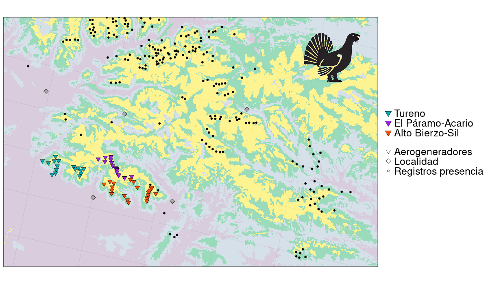

<style>
body {
text-align: justify}
</style>

<br/>
<p align="center">
 </a>
</p>
<font size="3">
<br/>

```{r setup, include=FALSE}
knitr::opts_chunk$set(echo = TRUE)
```
```{r klippy, echo=FALSE, include=TRUE, eval=T}
klippy::klippy(tooltip_message = 'Click para copiar', tooltip_success = 'Hecho!',position = c('top', 'right'))
```

 
# **Presentación**

En el siguiente script se evalúa la potencialidad del hábitat de oso pardo y urogallo en la Sierra de Gistredo, norte de León (España). Para ello, se utiliza el paquete `rgibif` para descargar registros de presencia de ambas especies, y posteriormente se combinan con una serie de predictores ambientales mediante diferentes técnicas de modelado (Lasso and Elastic-Net Regularized Generalized Linear Models, `glmnet`, _Tay et al. 2023_).

Para la ejecución del script deben descargarse diferentes ficheros (covariables predictoras, grid de predicción, etc.) que pueden encontrarse en este [link](https://drive.google.com/file/d/1lBfaR1ZkEQKnDbKMWS6YtZnW_vNkS4OW/view?usp=drive_link). Todos los archivos deben descomprimirse en la misma carpeta y debemos situar nuestro directorio de trabajo en esa carpeta usando `setwd("ruta/a/mi/carpeta")`.

- Tay JK, Narasimhan B, Hastie T (2023). “Elastic Net Regularization Paths for All
  Generalized Linear Models.” _Journal of Statistical Software_, *106*(1), 1-31.
  doi:10.18637/jss.v106.i01 <https://doi.org/10.18637/jss.v106.i01>
<br/><br/>

# **Análisis**

```{r ch1, message=F, cache = T, eval = F}
# Cargamos los paquetes necesarios
library(rgbif)
library(terra)
library(sf)
library(maxnet)

################################################################################
# Descarga de presencias de GBIF

# Almacenamos los nombres de las especies de estudio
species <- c("Tetrao urogallus", "Ursus arctos")

# Creamos una lista para almacenar las presencias de ambas especies

presencias <- list()

# Bucle para la descarga de presencias (posible almacenamiento en CSV)
for (i in 1:length(species)){
  print(species[i])
  
  # Con este sub-bucle comprobamos si el nombre científico suministrado es el 
  # nombre aceptado en el Backbone de GBIF
  nBb <- name_backbone(name=species[i], rank="species")
  if (nBb$status != "ACCEPTED"){
    key <- nBb$acceptedUsageKey
  } else { key <- nBb$usageKey }
  
  # Seleccionamos los campos que queremos
  selFields <- c("key","scientificName", "decimalLatitude","decimalLongitude",
                 "issues", "country", "basisOfRecord","year")
  
  # Descargamos los datos
  occ <- occ_search(taxonKey = key, fields = selFields, limit = 100000, 
                    country = c("ES","PT"), hasCoordinate = TRUE)
  
  # Unimos los datos para España y Portugal
  occ <- rbind(occ$ES$data, occ$PT$data)
  
  # Preparamos el data.frame y escribimos el CSV
  pres <- data.frame(sp=rep(species[i],nrow(occ)),
                     lon=occ$decimalLongitude,
                     lat=occ$decimalLatitude)
  # Limpiamos los registros con latitudes inferiores a 41º (evitar registros históricos)
  pres <- pres[pres$lat > 41,]
  
  # Almacenamos los registros en nuestra lista de presencias
  presencias[[i]] <- pres
  names(presencias)[i] <- species[i]
  # write.csv(pres, paste(species[i],".csv", sep = ""), row.names = F)
}

################################################################################
# Modelización con Maxent y "downscaling"

# Seleccionamos la carpeta donde hemos descomprimido y guardado todos los 
# ficheros descargados
varlist <- list.files(pattern='*.asc', full.names=TRUE)

# Preparamos las variables
predictors <- rast(varlist)
#predictorstabla<-as.data.frame(predictors)
#predictorstabla$ID <- 1:nrow(predictorstabla)
#predna <- na.omit(predictorstabla)

# Creamos y preparamos los puntos de background
lon <- runif(10000,ext(predictors)[1], ext(predictors)[2])
lat <- runif(10000,ext(predictors)[3], ext(predictors)[4])
bg <- data.frame(lon=lon, lat=lat)

# Preparamos el downscaling para el área de la Sierra de Gistredo
samp <- read_sf("sampWGS84.shp")
samp$habitat <- as.factor(samp$habitat)
samp$alt2 <- samp$alt^2

# Preparamos el grid de predicción del "downscaling" para la Sierra de Gistredo
gridpred <- read_sf("gridPred.shp")
gridpred$alt2 <- gridpred$alt^2
gridpred$habitat <- as.factor(gridpred$habitat)

# Con este bucle realizamos primero el modelo a nivel peninsular con Maxent para
# luego realizar el downscaling a cada una de las áreas de estudio.

# Lista para almacenar los modelos de Maxent
predMaxent <- list()

# Lista para almacenar los modelos reescalados a Gistredo
predGlm <- list()

for (j in 1:length(presencias)){
  # Vamos pasando por todas las especies
  occ <- presencias[[j]]
  print(occ[1,1])
  
  # Preparamos los datos
  resp <- c(rep(1,nrow(occ)),rep(0,10000))
  pp <- rbind(occ[,2:3], bg)
  dd <- na.omit(cbind(resp,extract(predictors,pp)))
  dat <- data.frame(dd[,3:8])
  
  # Corremos Maxent
  print("Running Maxent")
  mm <- maxnet(dd[,1], dat, maxnet.formula(dd[,1], dat, classes="lqpht"))
  # Realizamos las predicciones
  predna <- predict(mm, newdata = as.data.frame(predictors), clamp=T, type=c("cloglog"))
  
  # Limpiamos el raster de salida
  white <- predictors$bare
  white[as.numeric(rownames(predna))] <- predna[,1]
  predMaxent[[j]] <- white
  names(predMaxent[[j]]) <- occ[1,1]
  # Guardamos el raster del output del modelo Maxent
  # writeRaster(white, paste(occ[1,1],".asc",sep = ""), overwrite=TRUE)
  
  # Downscaling para el área de la Sierra de Gistredo
  print("Running GLM (downscaling)")
  suit <- extract(predMaxent[[j]], samp)
  samp$suit <- suit[,2]
  m1 <- glm(suit ~ habitat * alt * alt2, data = samp)
  gridpred$pred <- predict(m1, gridpred, type = "response")
  predGlm[[j]] <- gridpred
  names(predGlm)[[j]] <- occ[1,1]
  #write_sf(gridpred, paste(occ[1,1],"_glm.shp", sep = ""))
}
```


