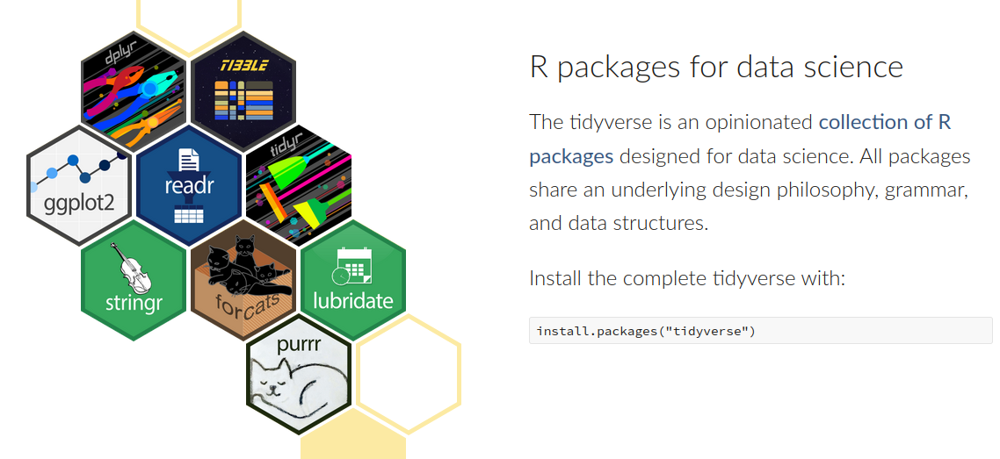

<style>
body {
text-align: justify}
</style>

<br/>
<br/>
<p align="center">
 </a>
</p>
<font size="3">
<br/>

```{r setup, include=FALSE}
knitr::opts_chunk$set(echo = TRUE)
```
```{r klippy, echo=FALSE, include=TRUE, eval=T}
klippy::klippy(tooltip_message = 'Click para copiar', tooltip_success = 'Hecho!',position = c('top', 'right'))
```

 
# **Introducción al entorno R**

#### **¿Por qué R?** 
R es un entorno y lenguaje de programación con un enfoque al análisis estadístico.

* R es una herramienta libre y gratuita para todos los sistemas operativos.
* R no es solamente un software para análisis estadístico.
* Es muy probable que tarde o temprano tengáis que utilizar esta herramienta.
<br/><br/>

#### **Descarga e instalación de R y RStudio** 

* **R** lo podemos descargar en [https://cran.r-project.org/](https://cran.r-project.org/) para los sistemas operativos Windows, macOS y Linux.
* **RStudio** lo podemos descargar en [https://posit.co/download/rstudio-desktop/](https://posit.co/download/rstudio-desktop/), también para cualquer sistema operativo

Una vez descargados, RStudio se vinculará con R automáticamente.
<br/><br/>

#### **Un paseo por R y RStudio** 

Es importante diferenciar entre R y RStudio. El software o lenguaje que utilizamos para los análisis estadisticos es **R**, por tanto podemos utilizar la consola de R por sí sola. **RStudio es un IDE** (del inglés _integrated development environment_), un entorno de desarrollo integrado, una "carcasa" que envuelve a R y facilita su uso. 
Es imporante familiarizarse con RStudio, ya que utilizaremos R a través de él. Tómate unos minutos para explorar sus diferentes paneles y personalizar su diseño:

* Diferencia entre _consola_ y _script_
* Visualiza tu _entorno de trabajo_, tu ventana de _gráficos (plots)_, tus _librerías (paquetes)_ cargadas, etc. 
* También puedes cambiar el color de fondo, aumentar el tamaño de letra, etc.


<br/>
<p align="center">
 </a>
</p>
<font size="3">
<br/><br/>

#### **Las `funciones()`**

Las **`funciones()`** son la "maquinaria" de R, las que realizan el trabajo. Se pueden identificar porque generalmente van seguidas de unos paréntesis entre los cuales se colocan sus **argumentos**. Los argumentos de una función son elementos que necesita esa función para ejecutarse y suelen ir separados por _comas_ $,$. Por ejemplo, existe una función que se llama "concatenar" (que en el lenguaje R se escribe `c()`), que simplemente sirve para unir en el mismo vector una serie de elementos (letras, números, etc.). Vamos a utilizar esa función para unir en un único vector una serie de números.

```{r ch1, message=F, cache = T, eval = T}
# La almohadilla se utiliza para incluir un comentario. Todo lo que se encuentre
# después de una almohadilla no se ejecutará en la consola.

# Unir los números 3, 7, 12 y 4 en un único vector
c(3, 7, 12, 4)

```

* ¿Cuál es la función? ¿Cuáles son sus argumentos?

Imaginemos que ahora queremos hallar la media de esos números. Podemos utilizar otra función denominada `mean()` a la cual le introduciremos los numeros que hemos concatenado anteriormente como único argumento:

```{r ch2, message=F, cache = T, eval = T}
# Obtener la media de los números 3, 7, 12 y 4
mean(c(3, 7, 12, 4))
```

Todas las funciones de R se alamcenan en "bibliotecas" o librerías (habitualmente denominados paquetes). Estos paquetes podemos entenderlos como cajas de herramientas donde se almacenan las herramientas que queremos utilizar. Hay algunos paquetes que vienen instalados y cargados por defecto en R. Sin embargo, otros los tenemos que descargar e instalar por primera vez y luego cargarlos en nuestra sesión cada vez que queramos utilizarlos. Por ejemplo, el paquete `lme4` se utiliza frecuentemente para ajustar modelos generales lineales mixtos. Podemos descargarlo, instalarlo y cargarlo en nuestra sesión de R de la siguiente manera:

```{r ch3, message=F, cache = T, eval = F}
# Descargamos e instalamos el paquete
install.packages("lme4")
# Cargamos el paquete en nuestra sesión
library(lme4)
```

Una de las grandes ventajas (o inconvenientes?) de R es que es un software libre, por lo que cualquiera puede desarrollar sus propios paquetes con las herramientas (funciones) que necesite y ponerlo a disposición de la comunidad de usuarios. Si tenéis curiosidad, [aquí](https://www.youtube.com/watch?v=ctsGXwaxA1o&list=PL4ZUlAlk7Qic9a6aBIMcRs7_CLbIzCalW) podéis encontrar un pequeño tutorial sobre como hacerlo.
<br/><br/>

#### **Los objetos**

Los **objetos** en R son los contenedores donde almacenamos los resultados (outputs) de las funciones. Podemos identificarlos porque suelen aparecer por primera vez precediendo a los caracteres `<-`, que simbolizan una flecha que señala hacia la izquierda. Cada vez que se quiera crear un objeto se le ha de dar un nombre, el que queramos, aunque suele ser conveniente darle un nombre que tenga sentido. Por ejemplo, vamos a almacenar en un objeto que vamos a llamar "numeros" la concatenación de valores que creamos anteriormente:

```{r ch4, message=F, cache = T, eval = T}
# Almacenamos en un objeto llamado "numeros" el resultado de concatenar 3, 7, 12 y 4
numeros <- c(3, 7, 12, 4)

# Ahora podemos "llamar" a "numeros" para ver qué tiene dentro
numeros

# También podemos utilizar a "numeros" dentro de otra función, por ejemplo mean()
mean(numeros)

# Por último podemos guardar dentro de otro objeto el resultado de la linea anterior

m <- mean(numeros)
m
```

 Todos los objetos en R tienen una clase, que informa sobre el tipo de objeto que es. Por ejemplo, si es un vector de números será `numeric`, pero si lo que almacena son caracteres su clase será `character`. Hay muschísimas clases de objetos (¡incluso se pueden crear clases nuevas!). Conocer la clase de nuestros objetos es muy important, puesto que **algunas funciones necesitan que sus argumentos sean de una clase específica**, y sino no funcionarán. Por ejemplo, no podemos hacer la media de las letras "a", "b" y "c", pero sí podremos hacer la media de los números 1, 2 y 3.

```{r ch5, message=T, cache = T, eval = T}
# Para averiguar la clase de un objeto usamos la función class()
class(numeros)

# Vamos a crear un objeto con los caracteres "a", "b" y "c"
letras <- c("a", "b", "c")

# Exploramos la clase de letras
class(letras)

# Vamos a intentar hacer la media de letras
mean(letras)

```
<br/>

#### **Entorno y directorio de trabajo**
Todos los objetos que vayamos creando o cargando en R se pueden visualizar en el panel `Environment` que suele situarse en la parte superior derecha en RStudio. En ese panel aparece información sobre los objetos, una previsualización o incluso, si el objeto lo permite, podemos hacer click en él y visualizarlos de forma intuitiva en formato "hoja de cálculo". <br/>
También es importante ser conscientes del directorio de trabajo en el que estamos trabajando, esto es, la carpeta en la que se guardarán los ficheros que salgan de R, o la carpeta desde donde se cargarán los ficheros. Para saber nuestro directorio de trabajo actual utilizamos la función `getwd()`, mienstras que para cambiarla utilizaremos `setwd("mi_directorio_de_trabajo_nuevo")`.

```{r ch6, message=T, cache = T, eval = T}
# Exploramos mi directorio de trabajo actual
getwd()

# Cambiamos el directorio de trabajo
setwd("/home/javifl/github/web/tutorials/estadisticaBasica_files")

```
<br/><br/>

#### **Trabajo con `data.frame`**
Uno de los objetos que más vamos a utilizar en la práctica es el `data.frame`, que podría asimilarse a un fichero similar a lo que podríamos visualizar en una hoja de cálculo tipo Excel. Vamos a utilizar la función `read.csv` leer un archivo de texto plano delimitado por comas (CSV del inglés _"comma separated values"_) y ensayar algunas cosas con él. Podéis echar un vistazo a este archivo [pinchando aquí](https://raw.githubusercontent.com/jabiologo/web/master/tutorials/estadisticaBasica_files/datosPracticas.csv).

```{r ch7, message=T, cache = T, eval = T}
# Guardamos el archivo en un obejto que denominaremos "datos"
datos <- read.csv("https://raw.githubusercontent.com/jabiologo/web/master/tutorials/estadisticaBasica_files/datosPracticas.csv")

class(datos)

# Podemos utilizar la función head() para explorar los primeros elementos de datos
head(datos)

# Podemos utilizar la función str() para ver la estructura interna del data.frame
str(datos)

# O incluso podemos pedirle un resumen con summary()
summary(datos)

```
<br/>

Tenemos varias formas de manejar los datos contenidos en un `data.frame`. Por ejemplo, si queremos explorar alguna columna podemos utilizar el símbolo del dólar `$` para seleccionarla por su nombre. Por ejemplo `datos$peso`. Si lo que queremos es seleccionar un dato en concreto, podemos utilizar los corchetes `[]` para acceder a los elementos del `data.frame` indicando su posición en cuanto a filas y columnas separados por una coma con la forma `datos[fila,columna]`. Por ejemplo, si queremos seleccionar el dato que está en la fila 3 y columna 4, podemos emplear `datos[3,4]`. Si dejamos uno de los dos huecos en blanco, obtendremos toda la fila o toda la columna. Por ejemplo, si quremos todos los datos de la fila 7, podemos hacer `datos[7, ]`. Veamos estos ejemplos.

```{r ch8, message=T, cache = T, eval = T}
# Visualizamos los nombres de las columnas de datos
colnames(datos)

# Visualizamos los 15 primeros elementos de la columna peso
datos$peso[1:15]

# Visualizamos el dato que está en la fila 3 y columna 4
datos[3,4]

# Visualizamos todos los datos de la fila 7
datos[7,]

```

Por último, vamos a ver una forma más moderna (y cómoda) de trabajar con los datos a través de `tydiverse`. Tydiverse es una coleccion de paquetes de R con una sintaxis en teoría más intuitiva que se centran en el manejo de datos. Utilizan el formato de "tuberías" o pipes mediante el símbolo `%>%`. Veamos un ejemplo.

```{r ch9, message=T, cache = T, eval = T}
# Instalamos (en caso necesario) y cargamos las librerías de tidyverse
# install.packages(tidiverse)
library(tidyverse)

# Tomamos el objeto datos, y lo filtramos dejando tan solo los machos
datosMacho <- datos %>% filter(sex == "Macho")

# Visualizamos los primeros elementos del nuevo objeto
head(datosMacho)

# También podemos obtener una muestra aleatoria de un número de filas
muestra11 <- datos %>% sample_n(11)

# Número de filas de muestra11
nrow(muestra11)

muestra11
```


<br/><br/>

#### **La ayuda `help()` y preguntar a Google**

Otra de las ventajas de R con respecto a otros lenguajes de programación es que sus paquetes deben de cumplir una serie de estándares para poder estar en el repositorio "oficial" [CRAN](https://cran.r-project.org/). Uno de los requerimientos es que las funciones de los diferentes paquetes deben de estar bien documentadas, es decir, debe existir un _manual_ que indique cómo se usa cada una de las funciones del paquete. Ese manual sigue siempre la misma estructura: nombre y descripción de la función, cómo se usa, los argumentos que necesita, el objeto que resulta al aplicar la función (Value), y unos ejemplos de cómo usar la función. Este manual o ayuda puede incluir más apartados, pero los mencionados suelen ser obligatorios. La forma de "llamar a la ayuda" en R es utilizando la función `help()`. Veamos un ejemplo:

```{r ch10, message=T, cache = T, eval = T}
# Vamos a intentar obtener la media del objeto letras
mean(letras)

# No entendemos por qué obtenemos este error... vamos a consultar la ayuda para
# entender qué necesita la función mean()
help(mean)

# Como vemos en el apartado Arguments, a la función mean() sólo se le pueden
# proporcionar objetos que sean de la clase numeric, logical, vectors, date,
# date-time y time_interval.
# Dado que la clase de letras es character, ahora entendemos por qué no podemos
# utilizar mean con letras.
```

Quizás la lección más importante es que normalmente ningún usuario habitual ha asistido a ningún curso especializado de R: la mayoría aprende a base de prueba/error y muchas horas delante del ordendaor con `ERROR` o `WARNINGS` en nuestra pantalla. Por eso es esencial no perder la paciencia y preguntar siempre a Google antes de preguntar al compañero que sabe (siemrpe hay alguien que ha tenido la misma duda antes que nosotros y ha dejado un comentario en un foro o blog). De esta forma interiorizaremos mucho mejor el funcionamiento de este lenguaje y aprenderemos mucho más rápido!

<br/><br/>

# **Manejo de bases de datos**

### **Manejo con R base**

Profundicemos ahora un poco en el manejo de bases de datos con R. La mayoría estamos acostumbrados a manejar archivos de hojas de cálculo tipo "Excel". Algunas de las acciones habituales son crear o eliminar columnas, modificar las existentes o filtrar filas. Todas estas acciones también las podemos hacer con R. Por comodidad, seguiremos utilizando nuestro `data.frame` que hemos denominado `datos`.

```{r ch11, message=T, cache = T, eval = F}
# Guardamos el archivo en un obejto que denominaremos "datos"
datos <- read.csv("https://raw.githubusercontent.com/jabiologo/web/master/tutorials/estadisticaBasica_files/datosPracticas.csv")

# Seleccionar sólo las columnas peso y habitat para quedarnos con ellas
# Ojo, sobreescribiremos el objeto datos
datos <- datos[,c(1,3)]

# Crear una columna nueva que sea el peso en kg
datos$peso_kg <- datos$peso/1000

# Crear una columna nueva que sea un identificador para cada individuo
datos$id <- 1:nrow(datos)

# Filtrar nuestro data.frame para uqedarnos con aquellos individuos que
# estén en hábitats Agrícolas y Urbanos

# Nos fijamos en el resultado de estos dos comandos
datos$hab == "Agricola"
datos$hab == "Urbano"
# Esto devuelve un vector logic con TRUE o FALSE, dependiendo de si coincide
# o no con "Agricola"/"Urbano". 

# Para usar el operador "o" (union), se usa el caracter "|"
datos$hab == "Agricola" | datos$hab == "Urbano"
# Esto nos devuelve un vector con TRUE en todas aquellas filas en las que la
# columna hab es "Agricola" o "Urbano". Con la siguiente orden obtenemos el
# mismo resultado:
datos$hab %in% c("Agricola", "Urbano")
# Se leería: "qué elementos de datos$hab están EN el vector "Agricola" "Ubrbano"

# Para comprobar que obtenemos el mismo resultado podríamos hacer:
(datos$hab %in% c("Agricola", "Urbano")) == 
  (datos$hab == "Agricola" | datos$hab == "Urbano")

# Una vez tenemos esas filas que nos interesan, podemos meterlas en la estructura
# habitual de manejo de data.frames para filtrar
datos <- datos[datos$hab == "Agricola" | datos$hab == "Urbano",]
```

<br/><br/>

### **Manejo con `tidyverse`**

Como podemos comprobar, esta forma de trabajar con los data.frames puede resultar un poco "engorrosa". Este ha sido el método tradicional en R para manejar bases de datos. Además, muchos paquetes de R para manipulación, visualización y análisis de datos funcionaban bien por separado, pero no siempre de forma coherente entre sí. Por eso, en el 2010, aparecen una serie de paquetes cuyo objetivo fue mejorar los flujos de trabajo con bases de datos en R. A este "universo" de paquetes (`dplyr`, `ggplot2`, `lubridate`, etc) con una sintaxis consistente entre ellos se le denominó `tidyverse`, y es a día de hoy uno de los ecosistemas de trabajo más utilizados en "ciencia de datos".

<br/>
<p align="center">
 </a>
</p>
<font size="3">
<br/><br/>

`tidyverse`, a través del paquete `magrittr` introduce un nuevo estilo de lenguaje a través de "pipes", que hace la sintaxis más intuitiva y natural. Veamos cómo podríamos hacer las mismas taréas con `tidiverse`.

```{r ch12, message=T, cache = T, eval = T}
# Instalamos el ecosistema tidyverse si fuera necesario
# install.packages("tidyverse")
library(tidyverse)

# Volvemos a cargar la base de datos original
datos <- read.csv("https://raw.githubusercontent.com/jabiologo/web/master/tutorials/estadisticaBasica_files/datosPracticas.csv")

# Realizamos todas las tareas usando dplyr, magrittr, etc.
datos <- datos %>%    # el comando %>% puede leerse como "y luego"...
  select(peso, hab) %>%   # Seleccionar solo las columnas peso y habitat
  mutate(peso_kg = peso / 1000, id = row_number()) %>%   # Crear nuevas columnas
  filter(hab %in% c("Agricola", "Urbano")) # Filtrar hábitats Agrícola y Urbano
```

<br/><br/>

Aunque es cierto que puede costar un poco acostumbrarse a esta nueva sintaxis si se aprendió R de la fórma "clásica", para nuevos usuarios suele resultar más fácil por ser un lenguaje más natural. En cualquier caso, es necesario conocerla, ya que es muy potente y la más utilizada hoy en día. Veamos algunas otras utilidades de dplyr.

```{r ch13, message=T, cache = T, eval = T}
# Utilizamos summarise para obtener estadísticos resumen de toda la base de datos 
datos %>% 
  summarise(peso_medio = mean(peso, na.rm = TRUE))

# Podemos usar group_by para que las siguientes acciones se apliquen por grupos
datos %>% 
  group_by(hab) %>% 
  summarise(peso_medio = mean(peso, na.rm = TRUE))

# Vamos a crear un nuevas medidas para algunos individuos
longitud <- data.frame(id = c(1,3,5), longitud = c(33, 36, 38))

# Ahora vamos a integrar estas nuevas medidas en nuestra base de datos
datos <- datos %>% 
  left_join(longitud, by = "id")

# Visualizamos el resultado
head(datos)

```

<br/><br/>

Vamos ahora a crear varios gráficos o plots de nuestros datos. Volveremos a cargar los datos y utilizaremos primero `R base` y luego el paquete `ggplot2`.

```{r ch14, message=T, cache = T, eval = T}
# Volvemos a cargar la base de datos original
datos <- read.csv("https://raw.githubusercontent.com/jabiologo/web/master/tutorials/estadisticaBasica_files/datosPracticas.csv")

# Vamos a realizar un histograma de nuestra variable "peso", un gráfico de cajas
# y bigotes que relacione el peso con el hábitat y un gráfico de dispersión que # relacione el peso con el contenido en triazoles.
# Histograma de peso
hist(datos$peso)

# Boxplot de peso ~ hábitat
boxplot(peso ~ hab, data = datos)

# Scatterplot de peso ~ triazoles
plot(datos$tri, datos$peso)

# Si queremos exportar estos gráficos, también podemos hacer:
# getwd()
# png("mi_plot.png", width = 480, height = 480)
# plot(datos$tri, datos$peso)
# dev.off()

# Veamos ahora las "equivalencias" con ggplot2

library(ggplot2)

# Histograma
ggplot(datos, aes(x = peso)) +
  geom_histogram(bins = 30, fill = "steelblue", color = "white") +
  labs(
    title = "Distribución del peso",
    x = "Peso",
    y = "Frecuencia"
  ) +
  theme_minimal()

# Boxplot
ggplot(datos, aes(x = hab, y = peso)) +
  geom_boxplot(fill = "tan") +
  labs(
    title = "Peso por hábitat",
    x = "Hábitat",
    y = "Peso"
  ) +
  theme_minimal()

# Scatterplot
ggplot(datos, aes(x = tri, y = peso)) +
  geom_point(size = 2, alpha = 0.7) +
  labs(
    title = "Relación entre triazoles y peso",
    x = "Triazoles",
    y = "Peso"
  ) +
  theme_minimal()

```


<br/><br/>

`ggplot2` es un sistema de visualización para R basado en la *Gramática de los Gráficos*. En lugar de elegir directamente un tipo de gráfico, el usuario construye las figuras por capas: primero define los datos y las variables que quiere representar, y después añade capas que controlan cómo se dibujan (puntos, cajas, barras), cómo se agrupan, las escalas, y el estilo final del gráfico.

```{r ch15, message=T, cache = T, eval = T}
# Guardamos en el objeto g_base los datos, el estilo común
g_base <- ggplot(datos) +
  theme_minimal() +
  labs(y = "Peso")

# Ahora simplemente añadimos el tipo de gráfico y las variables a graficar
g_base + aes(x = peso) + geom_histogram()
g_base + aes(x = hab, y = peso)  + geom_boxplot()
g_base + aes(x = tri, y = peso)  + geom_point()
```

# **Estadística descriptiva**

La estadística descriptiva es la rama de la estadística que se ocupa de resumir y describir un conjunto de datos mediante valores numéricos representativos.
En particular, utiliza medidas de tendencia central para indicar cuál es el valor “típico” de los datos, y medidas de dispersión para cuantificar cuánto varían o se alejan los datos entre sí.

## **Medidas de tendencia central**

### **La media**
Es el promedio aritmético de los datos y viene dada por la fórmula:
$$
\bar{x} = \frac{1}{n}\sum_{i=1}^{n} x_i
$$

### **La mediana**
Valor central cuando los datos están ordenados.

### **La moda**
Valor que aparece con mayor frecuencia.

## **Medidas de dispersión**

### **El rango**
Diferencia entre el valor máximo y el mínimo.

### **La varianza**
Promedio del cuadrado de las desviaciones respecto a la media, y viene dada por la fórmula (varianza muestral):

$$
s^2 = \frac{1}{n-1}\sum_{i=1}^{n} (x_i - \bar{x})^2
$$

### **La desviación estándar**
Raíz cuadrada de la varianza; mide la dispersión en las mismas unidades que los datos.

### **El coeficiente de variación**
Dispersión relativa respecto a la media.

<br/><br/>

Veamos ahora cómo podemos obtener algunas de estas medidas usando R:
```{r ch16, message=T, cache = T, eval = T}
# Volvemos a cargar la base de datos original
datos <- read.csv("https://raw.githubusercontent.com/jabiologo/web/master/tutorials/estadisticaBasica_files/datosPracticas.csv")

# Media del peso
mean(datos$peso)

# Varianza muestral del peso
var(datos$peso)

# Desviación estándar muestral del peso
sd(datos$peso)

# La función describe del paquete psych combina muchas medidas descriptivas
#install.packages("psych")
library(psych)

describe(datos)
# Podemos usar fix(describe) para ver qué hace la función "por dentro"

```

<br/><br/>

**NOTA:** Es importante recordar que estas medidas descriptivas pueden hacer referencia a la población o a la muestra. Las fórmulas y funciones que hemos presentado se refieren a las medidas muestrales. Las letras griegas se suelen reservar para las medidas poblacionales. Así, la media poblacional es $\mu$ (la letra griega _mu_, que representa la m de _mean_), mientras que la media muestral se denota normalmente como $\bar{x}$. Para la desviación estándar ocurre lo mismo: se usa $\sigma$ _sigma_ para la poblacional (que alude a la _s_ de _standar deviation_), mientras que para la muestral se usa la $s$.

| Concepto            | Muestra            | Población           |
|---------------------|--------------------|---------------------|
| Media               | $\bar{x}$          | $\mu$               |
| Varianza            | $s^2$              | $\sigma^2$          |
| Desv. estándar      | $s$                | $\sigma$            |

<br/><br/>

## **Ejercicios**

Utilizando la base de datos `litologia.xlsx` realiza las siguientes operaciones:

1) Carga el fichero en R. Intenta buscar información sobre el paquete `readxl`.
2) ¿Cuántas filas tiene el fichero?¿Cuántas columnas?
3) Indica el tipo de datos que tenemos en cada una de las columnas
4) Explora las variables `ph` y `elev` calculando las siguientes medidas descriptivas: media, mediana, rango, varianza, desviación estándar y coeficiente de variación.
5) ¿Cuál de las dos variables presenta una media mayor? ¿y una mediana?
6) ¿Qué variable dirías que presenta una mayor "dispersión"?
7) Realiza un histograma de cada una de las variables para estudiar de forma aproximada su distribución.
8) Explora mediante representaciones gráficas si existe una relación entre el pH y la elevación.

<br/><br/>

# **Distribuciones de probabilidad**

Podemos decir que las distribuciones de probabilidad son modelos matemáticos que describen cómo se reparten los posibles valores de una variable aleatoria y con qué probabilidad aparecen. Sirven como abstracciones matemáticas de realidades en las cuales estamos interesados y queremos investigar.

<br/><br/>

### **Distribución Normal o Gaussiana**

La distribución Normal es una distribución continua, simétrica y con forma de campana, caracterizada por su media (μ) y su desviación estándar (σ). Se utiliza para modelar variables cuantitativas continuas. Es simétrica alrededor de la media. La media, la mediana y la moda coinciden.

Aproximadamente:

* 68% de los valores están dentro de ±1σ
* 95% dentro de ±2σ
* 99.7% dentro de ±3σ

Ejemplos típicos:

* Altura de individuos
* Errores de medida
* Variables biológicas agregadas

