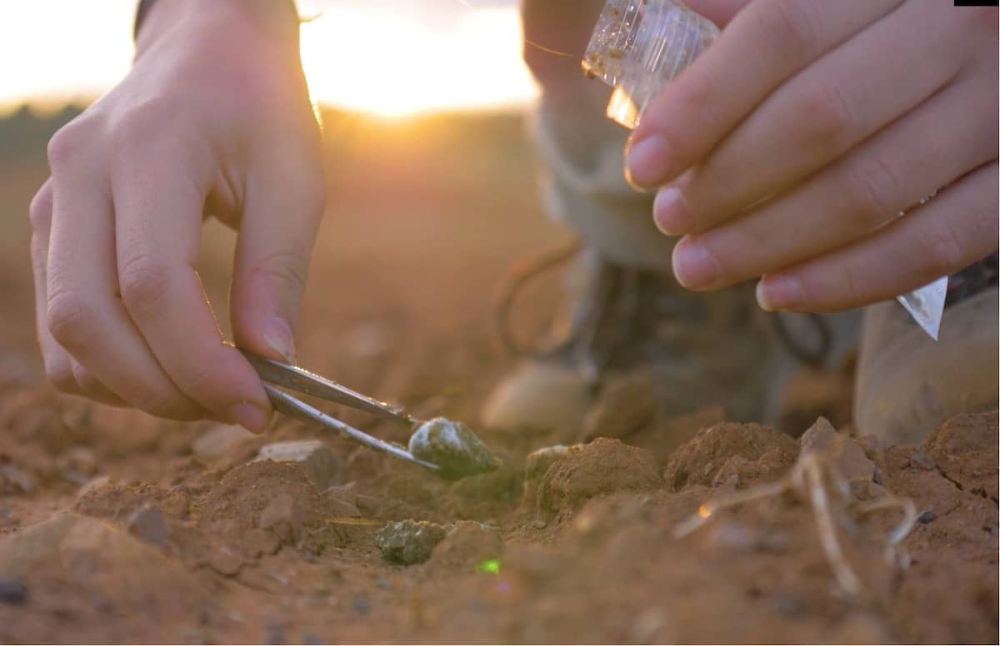

<style>
body {
text-align: justify}
</style>

<br/>
<br/>
<p align="center">
 </a>
</p>
<font size="3">
<br/>

```{r setup, include=FALSE}
knitr::opts_chunk$set(echo = TRUE)
```
```{r klippy, echo=FALSE, include=TRUE, eval=T}
klippy::klippy(tooltip_message = 'Click para copiar', tooltip_success = 'Hecho!',position = c('top', 'right'))
```

# **Presentación**

En este espacio se encuentran los materiales para el Módulo 2 - Modelos lineales generalizados, del curso Introducción a los Modelos Lineales: fundamentos teóricos y prácticos para la Universidad del Pais Vasco.

  * En este [enlace](https://jabiologo.github.io/web/tutorials/modulo2_compressed.pdf) se irán actualizando las presentaciones del módulo.
  * En este [enlace](https://jabiologo.github.io/web/tutorials/upv_practicas2.R) se encontrarán las plantillas de los scripts que iremos montando durante el curso.
  * En este [enlace](https://jabiologo.github.io/web/tutorials/upv_practicas2.R) se encuentran los datos necesarios para el caso practico.
  
# **Caso práctico 1**

Los [fungicidas triazoles](https://www.irec.es/publicaciones-destacadas/metodo-no-invasivo-exposicion-aves-fungicidas-triazoles/) son compuestos químicos que se aplican habitualmente en semillas de cultivos para prevenir el crecimiento de hongos patógenos de plantas. Sin embargo, cuando las semillas son consumidas por la fauna silvestre, estos compuestos pueden producir efectos crónicos perjudiciales en su sauld y desarrollo. Queremos estudiar el efecto de los fungicidas triazoles sobre la condición corporal (peso) en perdices rojas (_Alectoris rufa_). Para ello se han capturado un total de 300 perdices en tres hábitats diferentes (semiurbano, agrícola y monte matorralizado) a las que se les ha sexado y extraido muestras de heces para obtener la concentración de fungicidas triazoles (ngramos de compuesto/gramo de heces). La base de datos obtenida está almacenada en [este enlace](https://raw.githubusercontent.com/jabiologo/web/master/tutorials/estadisticaBasica_files/datosPracticas.csv). A continuación iremos realizando algunos test estadísticos vistos en teoría para responder a nuestra pregunta.

<br/>
<p align="center">
 </a>
</p>
<font size="3">
<br/>


```{r ch11, message=T, cache = T, eval = T}
# Guardamos el archivo en un obejto que denominaremos "datos"
datos <- read.csv("https://raw.githubusercontent.com/jabiologo/web/master/tutorials/estadisticaBasica_files/datosPracticas.csv")

# Podemos utilizar la función str() para ver la estructura interna del data.frame
str(datos)

```
<br/>

### Vuestro turno
* ¿Cuál es nuestra variable dependiente/respuesta?
* ¿Cuál o cuáles podrían ser nuestras variables independientes o predictores?
* ¿De qué tipo son nuestras variables? Contínuas, categóricas...
* Si hay variables categóricas (factores), ¿cuántos niveles tienen?
* ¿Qué tamaño muestral (_n_) tengo?
* ¿Están mis datos balanceados?
* ¿Qué distribución sigue mi variable respuesta? ¿y las variables predictoras?


